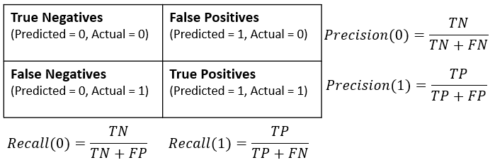

### Question 1: Logistic regression basics

You've now cleaned up the data and created the new data set cr_loan_clean.

Think back to the final scatter plot from chapter 1 which showed more defaults with high loan_int_rate. Interest rates are easy to understand, but what how useful are they for predicting the probability of default?

Since you haven't tried predicting the probability of default yet, test out creating and training a logistic regression model with just loan_int_rate. Also check the model's internal parameters, which are like settings, to see the structure of the model with this one column.

The data cr_loan_clean has already been loaded in the workspace.

**Instructions**

1. Create the X and y sets using the loan_int_rate and loan_status columns.
2. Create and fit a logistic regression model to the training data and call it clf_logistic_single.
3. Print the parameters of the model with .get_params().
4. Check the intercept of the model with the .intercept_ attribute.

**Pre Code**

```py
# Create the X and y data sets
X = ____[[____]]
y = ____[[____]]

# Create and fit a logistic regression model
____ = ____()
clf_logistic_single.____(X, np.ravel(____))

# Print the parameters of the model
print(____.____())

# Print the intercept of the model
print(____.____)
```

**Ans.**

```py
# Create the X and y data sets
X = cr_loan_clean[['loan_int_rate']]
y = cr_loan_clean[['loan_status']]

# Create and fit a logistic regression model
clf_logistic_single = LogisticRegression(solver='lbfgs')
clf_logistic_single.fit(X, np.ravel(y))

# Print the parameters of the model
print(clf_logistic_single.get_params())

# Print the intercept of the model
print(clf_logistic_single.intercept_)
```

### Question 2: Multivariate logistic regression

Generally, you won't use only loan_int_rate to predict the probability of default. You will want to use all the data you have to make predictions.

With this in mind, try training a new model with different columns, called features, from the cr_loan_clean data. Will this model differ from the first one? For this, you can easily check the .intercept_ of the logistic regression. Remember that this is the y-intercept of the function and the overall log-odds of non-default.

The cr_loan_clean data has been loaded in the workspace along with the previous model clf_logistic_single.

**Instructions**

1. Create a new X data set with loan_int_rate and person_emp_length. Store it as X_multi.
2. Create a y data set with just loan_status.
3. Create and .fit() a LogisticRegression() model on the new X data. Store it as clf_logistic_multi.
4. Print the .intercept_ value of the model

**Pre Code**

```py
# Create X data for the model
X_multi = ____[[____,____]]

# Create a set of y data for training
y = ____[[____]]

# Create and train a new logistic regression
clf_logistic_multi = ____(solver='lbfgs').____(____, np.ravel(____))

# Print the intercept of the model
print(____.____)
```

**Ans.**

```py
# Create X data for the model
X_multi = cr_loan_clean[['loan_int_rate','person_emp_length']]

# Create a set of y data for training
y = cr_loan_clean[['loan_status']]

# Create and train a new logistic regression
clf_logistic_multi = LogisticRegression(solver='lbfgs').fit(X_multi, np.ravel(y))

# Print the intercept of the model
print(clf_logistic_multi.intercept_)
```

### Question 3: Creating training and test sets

You've just trained LogisticRegression() models on different columns.

You know that the data should be separated into training and test sets. test_train_split() is used to create both at the same time. The training set is used to make predictions, while the test set is used for evaluation. Without evaluating the model, you have no way to tell how well it will perform on new loan data.

In addition to the intercept_, which is an attribute of the model, LogisticRegression() models also have the .coef_ attribute. This shows how important each training column is for predicting the probability of default.

The data set cr_loan_clean is already loaded in the workspace.

**Instructions**

1. Create the data set X using interest rate, employment length, and income. Create the y set using loan status.
2. Use train_test_split() to create the training and test sets from X and y.
3. Create and train a LogisticRegression() model and store it as clf_logistic.
4. Print the coefficients of the model using .coef_.

**Pre Code**

```py
# Create the X and y data sets
X = ____[[____,____,____]]
y = ____[[____]]

# Use test_train_split to create the training and test sets
X_train, X_test, y_train, y_test = ____(____, ____, test_size=.4, random_state=123)

# Create and fit the logistic regression model
____ = ____(solver='lbfgs').____(____, np.ravel(____))

# Print the models coefficients
print(____.coef_)
```

**Ans.**

```py
# Create the X and y data sets
X = cr_loan_clean[['loan_int_rate','person_emp_length','person_income']]
y = cr_loan_clean[['loan_status']]

# Use test_train_split to create the training and test sets
X_train, X_test, y_train, y_test = train_test_split(X, y, test_size=.4, random_state=123)

# Create and fit the logistic regression model
clf_logistic = LogisticRegression(solver='lbfgs').fit(X_train, np.ravel(y_train))

# Print the models coefficients
print(clf_logistic.coef_)
```

### Question 4: Changing coefficients

With this understanding of the coefficients of a LogisticRegression() model, have a closer look at them to see how they change depending on what columns are used for training. Will the column coefficients change from model to model?

You should .fit() two different LogisticRegression() models on different groups of columns to check. You should also consider what the potential impact on the probability of default might be.

The data set cr_loan_clean has already been loaded into the workspace along with the training sets X1_train, X2_train, and y_train.

**Instructions**

1. Check the first five rows of both X training sets.
2. Train a logistic regression model, called clf_logistic1, with the X1 training set.
3. Train a logistic regression model, called clf_logistic2, with the X2 training set.
4. Print the coefficients for both logistic regression models.

**Pre Code**

```py
# Print the first five rows of each training set
print(____.____())
print(____.____())

# Create and train a model on the first training data
____ = ____(solver='lbfgs').____(____, np.ravel(y_train))

# Create and train a model on the second training data
____ = ____(solver='lbfgs').____(____, np.ravel(y_train))

# Print the coefficients of each model
print(____.____)
print(____.____)
```

**Ans.**

```py
# Print the first five rows of each training set
print(X1_train.head())
print(X2_train.head())

# Create and train a model on the first training data
clf_logistic1 = LogisticRegression(solver='lbfgs').fit(X1_train, np.ravel(y_train))

# Create and train a model on the second training data
clf_logistic2 = LogisticRegression(solver='lbfgs').fit(X2_train, np.ravel(y_train))

# Print the coefficients of each model
print(clf_logistic1.coef_)
print(clf_logistic2.coef_)
```

### Question 5: One-hot encoding credit data

It's time to prepare the non-numeric columns so they can be added to your LogisticRegression() model.

Once the new columns have been created using one-hot encoding, you can concatenate them with the numeric columns to create a new data frame which will be used throughout the rest of the course for predicting probability of default.

Remember to only one-hot encode the non-numeric columns. Doing this to the numeric columns would create an incredibly wide data set!

The credit loan data, cr_loan_clean, has already been loaded in the workspace.

**Instructions**

1. Create a data set for all the numeric columns called cred_num and one for the non-numeric columns called cred_str.
2. Use one-hot encoding on cred_str to create a new data set called cred_str_onehot.
3. Union cred_num with the new one-hot encoded data and store the results as cr_loan_prep.
4. Print the columns of the new data set.

**Pre Code**

```py
# Create two data sets for numeric and non-numeric data
____ = ____.select_dtypes(exclude=['object'])
____ = ____.select_dtypes(include=['object'])

# One-hot encode the non-numeric columns
____ = pd.____(____)

# Union the one-hot encoded columns to the numeric ones
____ = pd.concat([____, ____], axis=1)

# Print the columns in the new data set
print(____.columns)
```

**Ans.**

```py
# Create two data sets for numeric and non-numeric data
cred_num = cr_loan_clean.select_dtypes(exclude=['object'])
cred_str = cr_loan_clean.select_dtypes(include=['object'])

# One-hot encode the non-numeric columns
cred_str_onehot = pd.get_dummies(cred_str)

# Union the one-hot encoded columns to the numeric ones
cr_loan_prep = pd.concat([cred_num, cred_str_onehot], axis=1)

# Print the columns in the new data set
print(cr_loan_prep.columns)
```

### Question 6: Predicting probability of default

All of the data processing is complete and it's time to begin creating predictions for probability of default. You want to train a LogisticRegression() model on the data, and examine how it predicts the probability of default.

So that you can better grasp what the model produces with predict_proba, you should look at an example record alongside the predicted probability of default. How do the first five predictions look against the actual values of loan_status?

The data set cr_loan_prep along with X_train, X_test, y_train, and y_test have already been loaded in the workspace.

**Instructions**

1. Train a logistic regression model on the training data and store it as clf_logistic.
2. Use predict_proba() on the test data to create the predictions and store them in preds.
3. Create two data frames, preds_df and true_df, to store the first five predictions and true loan_status values.
4. Print the true_df and preds_df as one set using .concat().

**Pre Code**

```py
# Train the logistic regression model on the training data
____ = ____(solver='lbfgs').____(____, np.ravel(____))

# Create predictions of probability for loan status using test data
____ = clf_logistic.____(____)

# Create dataframes of first five predictions, and first five true labels
____ = pd.DataFrame(____[:,1][0:5], columns = ['prob_default'])
____ = y_test.____()

# Concatenate and print the two data frames for comparison
print(pd.____([true_df.reset_index(drop = True), preds_df], axis = 1))
```

**Ans.**

```py
# Train the logistic regression model on the training data
clf_logistic = LogisticRegression(solver='lbfgs').fit(X_train, np.ravel(y_train))

# Create predictions of probability for loan status using test data
preds = clf_logistic.predict_proba(X_test)

# Create dataframes of first five predictions, and first five true labels
preds_df = pd.DataFrame(preds[:,1][0:5], columns = ['prob_default'])
true_df = y_test.head()

# Concatenate and print the two data frames for comparison
print(pd.concat([true_df.reset_index(drop = True), preds_df], axis = 1))
```

### Question 7: Default classification reporting

It's time to take a closer look at the evaluation of the model. Here is where setting the threshold for probability of default will help you analyze the model's performance through classification reporting.

Creating a data frame of the probabilities makes them easier to work with, because you can use all the power of pandas. Apply the threshold to the data and check the value counts for both classes of loan_status to see how many predictions of each are being created. This will help with insight into the scores from the classification report.

The cr_loan_prep data set, trained logistic regression clf_logistic, true loan status values y_test, and predicted probabilities, preds are loaded in the workspace.

**Instructions**

1. Create a data frame of just the probabilities of default from preds called preds_df.
2. Reassign loan_status values based on a threshold of 0.50 for probability of default in preds_df.
3. Print the value counts of the number of rows for each loan_status.
4. Print the classification report using y_test and preds_df.

**Pre Code**

```py
# Create a dataframe for the probabilities of default
____ = pd.____(____[:,1], columns = ['prob_default'])

# Reassign loan status based on the threshold
____[____] = ____[____].apply(lambda x: 1 if x > ____ else 0)

# Print the row counts for each loan status
print(____[____].____())

# Print the classification report
target_names = ['Non-Default', 'Default']
print(____(____, ____['loan_status'], target_names=target_names))
```

**Ans.**

```py
# Create a dataframe for the probabilities of default
preds_df = pd.DataFrame(preds[:,1], columns = ['prob_default'])

# Reassign loan status based on the threshold
preds_df['loan_status'] = preds_df['prob_default'].apply(lambda x: 1 if x > 0.50 else 0)

# Print the row counts for each loan status
print(preds_df['loan_status'].value_counts())

# Print the classification report
target_names = ['Non-Default', 'Default']
print(classification_report(y_test, preds_df['loan_status'], target_names=target_names))
```

### Question 8: Selecting report metrics

The classification_report() has many different metrics within it, but you may not always want to print out the full report. Sometimes you just want specific values to compare models or use for other purposes.

There is a function within scikit-learn that pulls out the values for you. That function is precision_recall_fscore_support() and it takes in the same parameters as classification_report.

It is imported and used like this:

```py
# Import function
from sklearn.metrics import precision_recall_fscore_support

# Select all non-averaged values from the report
precision_recall_fscore_support(y_true,predicted_values)
```

The cr_loan_prep data set along with the predictions in preds_df have already been loaded in the workspace.

**Instructions 1/3**

1. Print the classification report for y_test and predicted loan status.

**Pre Code**

```py
# Print the classification report
target_names = ['Non-Default', 'Default']
print(____(____, ____[____], target_names=target_names))
```

**Ans.**

```py
# Print the classification report
target_names = ['Non-Default', 'Default']
print(classification_report(y_test, preds_df['loan_status'], target_names=target_names))
```

**Instructions 2/3**

1. Print all the non-average values using precision_recall_fscore_support().

**Pre Code**

```py
# Print all the non-average values from the report
print(____(____,____[____]))
```

**Ans.**

```py
# Print all the non-average values from the report
print(precision_recall_fscore_support(y_test,preds_df['loan_status']))
```

**Instructions 3/3**

1. Print only the first two values from the report by subsetting the string with [].

**Pre Code**

```py
# Print the first two numbers from the report
print(____(____,____[____])[____])
```

**Ans.**

```py
# Print the first two numbers from the report
print(precision_recall_fscore_support(y_test,preds_df['loan_status'])[0])
```

### Question 9: Visually scoring credit models

Now, you want to visualize the performance of the model. In ROC charts, the X and Y axes are two metrics you've already looked at: the false positive rate (fall-out), and the true positive rate (sensitivity).

You can create a ROC chart of it's performance with the following code:

```py
fallout, sensitivity, thresholds = roc_curve(y_test, prob_default)
plt.plot(fallout, sensitivity)
```

To calculate the AUC score, you use roc_auc_score().

The credit data cr_loan_prep along with the data sets X_test and y_test have all been loaded into the workspace. A trained LogisticRegression() model named clf_logistic has also been loaded into the workspace.

**Instructions**

1. Create a set of predictions for probability of default and store them in preds.
2. Print the accuracy score the model on the X and y test sets.
3. Use roc_curve() on the test data and probabilities of default to create fallout and sensitivity Then, create a ROC curve plot with fallout on the x-axis.
4. Compute the AUC of the model using test data and probabilities of default and store it in auc.

**Pre Code**

```py
# Create predictions and store them in a variable
____ = clf_logistic.____(____)

# Print the accuracy score the model
print(clf_logistic.____(____, ____))

# Plot the ROC curve of the probabilities of default
prob_default = preds[:, 1]
fallout, sensitivity, thresholds = ____(____, ____)
plt.plot(fallout, sensitivity, color = 'darkorange')
plt.plot([0, 1], [0, 1], linestyle='--')
plt.____()

# Compute the AUC and store it in a variable
____ = ____(____, ____)
```

**Ans.**

```py
# Create predictions and store them in a variable
preds = clf_logistic.predict_proba(X_test)

# Print the accuracy score the model
print(clf_logistic.score(X_test, y_test))

# Plot the ROC curve of the probabilities of default
prob_default = preds[:, 1]
fallout, sensitivity, thresholds = roc_curve(y_test, prob_default)
plt.plot(fallout, sensitivity, color = 'darkorange')
plt.plot([0, 1], [0, 1], linestyle='--')
plt.show()

# Compute the AUC and store it in a variable
auc = roc_auc_score(y_test, prob_default)
```

### Question 10: Thresholds and confusion matrices

You've looked at setting thresholds for defaults, but how does this impact overall performance? To do this, you can start by looking at the effects with confusion matrices.

Recall the confusion matrix as shown here:



Set different values for the threshold on probability of default, and use a confusion matrix to see how the changing values affect the model's performance.

The data frame of predictions, preds_df, as well as the model clf_logistic have been loaded in the workspace.

**Instructions 1/3**

1. Reassign values of loan_status using a threshold of 0.5 for probability of default within preds_df.
2. Print the confusion matrix of the y_test data and the new loan status values.

**Pre Code**

```py
# Set the threshold for defaults to 0.5
____[____] = ____[____].apply(lambda x: 1 if x > ____ else 0)

# Print the confusion matrix
print(____(____,____[____]))
```

**Ans.**

```py
# Set the threshold for defaults to 0.5
preds_df['loan_status'] = preds_df['prob_default'].apply(lambda x: 1 if x > 0.5 else 0)

# Print the confusion matrix
print(confusion_matrix(y_test,preds_df['loan_status']))
```

**Instructions 2/3**

1. Reassign values of loan_status using a threshold of 0.4 for probability of default within preds_df.
2. Print the confusion matrix of the y_test data and the new loan status values.

**Pre Code**

```py
# Set the threshold for defaults to 0.4
____[____] = ____[____].apply(lambda x: 1 if x > ____ else 0)

# Print the confusion matrix
print(____(____,____[____]))
```

**Ans.**

```py
# Set the threshold for defaults to 0.4
preds_df['loan_status'] = preds_df['prob_default'].apply(lambda x: 1 if x > 0.4 else 0)

# Print the confusion matrix
print(confusion_matrix(y_test,preds_df['loan_status']))
```

**Instructions 3/3**

Based on the confusion matrices you just created, calculate the default recall for each. Using these values, answer the following: which threshold gives us the highest value for default recall?

1. 0.4
2. 0.5

**Ans.** 1

### Question 11: How thresholds affect performance

Setting the threshold to 0.4 shows promising results for model evaluation. Now you can assess the financial impact using the default recall which is selected from the classification reporting using the function precision_recall_fscore_support().

For this, you will estimate the amount of unexpected loss using the default recall to find what proportion of defaults you did not catch with the new threshold. This will be a dollar amount which tells you how much in losses you would have if all the unfound defaults were to default all at once.

The average loan value, avg_loan_amnt has been calculated and made available in the workspace along with preds_df and y_test.

**Instructions**

1. Reassign the loan_status values using the threshold 0.4.
2. Store the number of defaults in preds_df by selecting the second value from the value counts and store it as num_defaults.
3. Get the default recall rate from the classification matrix and store it as default_recall
4. Estimate the unexpected loss from the new default recall by multiplying 1 - default_recall by the average loan amount and number of default loans.

**Pre Code**

```py
# Reassign the values of loan status based on the new threshold
____[____] = ____[____].____(lambda x: 1 if x > ____ else 0)

# Store the number of loan defaults from the prediction data
____ = preds_df[____].____()[1]

# Store the default recall from the classification report
____ = ____(____,preds_df[____])[1][1]

# Calculate the estimated impact of the new default recall rate
print(____ * ____ * (1 - ____))
```

**Ans.**

```py
# Reassign the values of loan status based on the new threshold
preds_df['loan_status'] = preds_df['prob_default'].apply(lambda x: 1 if x > 0.4 else 0)

# Store the number of loan defaults from the prediction data
num_defaults = preds_df['loan_status'].value_counts()[1]

# Store the default recall from the classification report
default_recall = precision_recall_fscore_support(y_test,preds_df['loan_status'])[1][1]

# Calculate the estimated impact of the new default recall rate
print(num_defaults * avg_loan_amnt * (1 - default_recall))
```

### Question 12: Threshold selection

You know there is a trade off between metrics like default recall, non-default recall, and model accuracy. One easy way to approximate a good starting threshold value is to look at a plot of all three using matplotlib. With this graph, you can see how each of these metrics look as you change the threshold values and find the point at which the performance of all three is good enough to use for the credit data.

The threshold values thresh, default recall values def_recalls, the non-default recall values nondef_recalls and the accuracy scores accs have been loaded into the workspace. To make the plot easier to read, the array ticks for x-axis tick marks has been loaded as well.

**Instructions 1/2**

1. Plot the graph of thresh for the x-axis then def_recalls, non-default recall values, and accuracy scores on each y-axis.

**Pre Code**

```py
plt.plot(____,____)
plt.plot(____,____)
plt.plot(____,____)
plt.xlabel("Probability Threshold")
plt.xticks(ticks)
plt.legend(["Default Recall","Non-default Recall","Model Accuracy"])
plt.____()
```

**Ans.**

```py
plt.plot(thresh,def_recalls)
plt.plot(thresh,nondef_recalls)
plt.plot(thresh,accs)
plt.xlabel("Probability Threshold")
plt.xticks(ticks)
plt.legend(["Default Recall","Non-default Recall","Model Accuracy"])
plt.show()
```

**Instructions 2/2**

Have a closer look at this plot. In fact, expand the window to get a really good look. Think about the threshold values from thresh and how they affect each of these three metrics. Approximately what starting threshold value would maximize these scores evenly?

1. 0.2
2. 0.55
3. 0.45
4. 0.275

**Ans.** 4 

<hr>