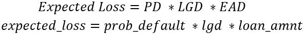

### Question 1: Trees for defaults

You will now train a gradient boosted tree model on the credit data, and see a sample of some of the predictions. Do you remember when you first looked at the predictions of the logistic regression model? They didn't look good. Do you think this model be different?

The credit data cr_loan_prep, the training sets X_train and y_train, and the test data X_test is available in the workspace. The XGBoost package is loaded as xgb.

**Instructions**

1. Create and train a gradient boosted tree using XGBClassifier() and name it clf_gbt.
2. Predict probabilities of default on the test data and store the results in gbt_preds.
3. Create two data frames, preds_df and true_df, to store the first five predictions and true loan_status values.
4. Concatenate and print the data frames true_df and preds_df in order, and check the model's results.

**Pre Code**

```py
# Train a model
import xgboost as xgb
____ = xgb.____().fit(____, np.ravel(____))

# Predict with a model
____ = clf_gbt.____(____)

# Create dataframes of first five predictions, and first five true labels
____ = pd.DataFrame(____[:,1][0:5], columns = ['prob_default'])
____ = y_test.____()

# Concatenate and print the two data frames for comparison
print(pd.____([____.reset_index(drop = True), ____], axis = 1))
```

**Ans.**

```py
# Train a model
import xgboost as xgb
clf_gbt = xgb.XGBClassifier().fit(X_train, np.ravel(y_train))

# Predict with a model
gbt_preds = clf_gbt.predict_proba(X_test)

# Create dataframes of first five predictions, and first five true labels
preds_df = pd.DataFrame(gbt_preds[:,1][0:5], columns = ['prob_default'])
true_df = y_test.head()

# Concatenate and print the two data frames for comparison
print(pd.concat([true_df.reset_index(drop = True), preds_df], axis = 1))
```

### Question 2: Gradient boosted portfolio performance

At this point you've looked at predicting probability of default using both a LogisticRegression() and XGBClassifier(). You've looked at some scoring and have seen samples of the predictions, but what is the overall affect on portfolio performance? Try using expected loss as a scenario to express the importance of testing different models.

A data frame called portfolio has been created to combine the probabilities of default for both models, the loss given default (assume 20% for now), and the loan_amnt which will be assumed to be the exposure at default.

<br>

The data frame cr_loan_prep along with the X_train and y_train training sets have been loaded into the workspace.

**Instructions**

1. Print the first five rows of portfolio.
2. Create the expected_loss column for the gbt and lr model named gbt_expected_loss and lr_expected_loss.
3. Print the sum of lr_expected_loss for the entire portfolio.
4. Print the sum of gbt_expected_loss for the entire portfolio.

**Pre Code**

```py
# Print the first five rows of the portfolio data frame
print(____.____())

# Create expected loss columns for each model using the formula
portfolio[____] = portfolio[____] * portfolio[____] * portfolio[____]
portfolio[____] = portfolio[____] * portfolio[____] * portfolio[____]

# Print the sum of the expected loss for lr
print('LR expected loss: ', np.____(____[____]))

# Print the sum of the expected loss for gbt
print('GBT expected loss: ', np.____(____[____]))
```

**Ans.**

```py
# Print the first five rows of the portfolio data frame
print(portfolio.head())

# Create expected loss columns for each model using the formula
portfolio['gbt_expected_loss'] = portfolio['gbt_prob_default'] * portfolio['lgd'] * portfolio['loan_amnt']
portfolio['lr_expected_loss'] = portfolio['lr_prob_default'] * portfolio['lgd'] * portfolio['loan_amnt']

# Print the sum of the expected loss for lr
print('LR expected loss: ', np.sum(portfolio['lr_expected_loss']))

# Print the sum of the expected loss for gbt
print('GBT expected loss: ', np.sum(portfolio['gbt_expected_loss']))
```

### Question 3: Assessing gradient boosted trees

So you've now used XGBClassifier() models to predict probability of default. These models can also use the .predict() method for creating predictions that give the actual class for loan_status.

You should check the model's initial performance by looking at the metrics from the classification_report(). Keep in mind that you have not set thresholds for these models yet.

The data sets cr_loan_prep, X_test, and y_test have already been loaded in the workspace. The model clf_gbt has been loaded as well. The classification_report() for the logistic regression will print automatically.

**Instructions**

1. Predict the loan_status values for the X test data and store them in gbt_preds.
2. Check the contents of gbt_preds to see predicted loan_status values not probabilities of default.
3. Print a classification_report() of the model's performance against y_test.

**Pre Code**

```py
# Predict the labels for loan status
____ = clf_gbt.____(____)

# Check the values created by the predict method
print(____)

# Print the classification report of the model
target_names = ['Non-Default', 'Default']
print(classification_report(____, ____, target_names=target_names))
```

**Ans.**

```py
# Predict the labels for loan status
gbt_preds = clf_gbt.predict(X_test)

# Check the values created by the predict method
print(gbt_preds)

# Print the classification report of the model
target_names = ['Non-Default', 'Default']
print(classification_report(y_test, gbt_preds, target_names=target_names))
```

### Question 4: Column importance and default prediction

When using multiple training sets with many different groups of columns, it's important to keep and eye on which columns matter and which do not. It can be expensive or time-consuming to maintain a set of columns even though they might not have any impact on loan_status.

The X data for this exercise was created with the following code:

```py
X = cr_loan_prep[['person_income','loan_int_rate',
                  'loan_percent_income','loan_amnt',
                  'person_home_ownership_MORTGAGE','loan_grade_F']]
```

Train an XGBClassifier() model on this data, and check the column importance to see how each one performs to predict loan_status.

The cr_loan_pret data set along with X_train and y_train have been loaded in the workspace.

**Instructions**

1. Create and train a XGBClassifier() model on the X_train and y_train training sets and store it as clf_gbt.
2. Print the column importances for the columns in clf_gbt by using .get_booster() and .get_score().

**Pre Code**

```py
# Create and train the model on the training data
____ = xgb.____().____(____,np.ravel(____))

# Print the column importances from the model
print(clf_gbt.____().____(importance_type = 'weight'))
```

**Ans.**

```py
# Create and train the model on the training data
clf_gbt = xgb.XGBClassifier().fit(X_train,np.ravel(y_train))

# Print the column importances from the model
print(clf_gbt.get_booster().get_score(importance_type = 'weight'))
```

### Question 5: Visualizing column importance

When the model is trained on different sets of columns it changes the performance, but does the importance for the same column change depending on which group it's in?

The data sets X2 and X3 have been created with the following code:

```py
X2 = cr_loan_prep[['loan_int_rate','person_emp_length']]
X3 = cr_loan_prep[['person_income','loan_int_rate','loan_percent_income']]
```

Understanding how different columns are used to arrive at a loan_status prediction is very important for model interpretability.

The data sets cr_loan_prep, X2_train, X2_test, X3_train, X3_test, y_train, y_test are loaded in the workspace.

**Instructions 1/2**

1. Create and train a XGBClassifier() model on X2_train and call it clf_gbt2.
2. Plot the column importances for the columns that clf_gbt2 trained on.

**Pre Code**

```py
# Train a model on the X data with 2 columns
____ = xgb.____().____(____,np.ravel(____))

# Plot the column importance for this model
xgb.____(____, importance_type = 'weight')
plt.____()
```

**Ans.**

```py
# Train a model on the X data with 2 columns
clf_gbt2 = xgb.XGBClassifier().fit(X2_train,np.ravel(y_train))

# Plot the column importance for this model
xgb.plot_importance(clf_gbt2, importance_type = 'weight')
plt.show()
```

**Instructions 2/2**

1. Create and train another XGBClassifier() model on X3_train and call it clf_gbt3.
2. Plot the column importances for the columns that clf_gbt3 trained on.

**Pre Code**

```py
# Train a model on the X data with 3 columns
____ = xgb.____().____(____,np.ravel(____))

# Plot the column importance for this model
xgb.____(____, importance_type = 'weight')
plt.____()
```

**Ans.**

```py
# Train a model on the X data with 3 columns
clf_gbt3 = xgb.XGBClassifier().fit(X3_train,np.ravel(y_train))

# Plot the column importance for this model
xgb.plot_importance(clf_gbt3, importance_type = 'weight')
plt.show()
```

### Question 6: Column selection and model performance

Creating the training set from different combinations of columns affects the model and the importance values of the columns. Does a different selection of columns also affect the F-1 scores, the combination of the precision and recall, of the model? You can answer this question by training two different models on two different sets of columns, and checking the performance.

Inaccurately predicting defaults as non-default can result in unexpected losses if the probability of default for these loans was very low. You can use the F-1 score for defaults to see how the models will accurately predict the defaults.

The credit data, cr_loan_prep and the two training column sets X and X2 have been loaded in the workspace. The models gbt and gbt2 have already been trained.

**Instructions 1/2**

1. Use both gbt and gbt2 to predict loan_status and store the values in gbt_preds and gbt2_preds.
2. Print the classification_report() of the first model.
3. Print the classification_report() of the second model.

**Pre Code**

```py
# Predict the loan_status using each model
____ = gbt.____(____)
____ = gbt2.____(____)

# Print the classification report of the first model
target_names = ['Non-Default', 'Default']
print(____(____, ____, target_names=target_names))

# Print the classification report of the second model
print(____(____, ____, target_names=target_names))
```

**Ans.**

```py
# Predict the loan_status using each model
gbt_preds = gbt.predict(X_test)
gbt2_preds = gbt2.predict(X2_test)

# Print the classification report of the first model
target_names = ['Non-Default', 'Default']
print(classification_report(y_test, gbt_preds, target_names=target_names))

# Print the classification report of the second model
print(classification_report(y_test, gbt2_preds, target_names=target_names))
```

**Instructions 2/2**

Have a look at the classification_report() for both models. What is the highest F-1 score for predicting defaults?

1. 0.72
2. 0.92
3. 0.69
4. 0.94

**Ans.** 1

### Question 7: Cross validating credit models

Credit loans and their data change over time, and it won't always look like what's been loaded into the current test sets. So, you can use cross-validation to try several smaller training and test sets which are derived from the original X_train and y_train.

Use the XGBoost function cv() to perform cross-validation. You will need to set up all the parameters for cv() to use on the test data.

The data sets X_train, y_train are loaded in the workspace along with the trained model gbt, and the parameter dictionary params which will print once the exercise loads.

**Instructions**

1. Set the number of folds to 5 and the stopping to 10. Store them as n_folds and early_stopping.
2. Create the matrix object DTrain using the training data.
3. Use cv() on the parameters, folds, and early stopping objects. Store the results as cv_df.
4. Print the contents of cv_df.

**Pre Code**

```py
# Set the values for number of folds and stopping iterations
____ = ____
____ = ____

# Create the DTrain matrix for XGBoost
____ = xgb.____(____, label = ____)

# Create the data frame of cross validations
____ = xgb.cv(____, ____, num_boost_round = 5, nfold=____,
            early_stopping_rounds=____)

# Print the cross validations data frame
____(____)
```

**Ans.**

```py
# Set the values for number of folds and stopping iterations
n_folds = 5
early_stopping = 10

# Create the DTrain matrix for XGBoost
DTrain = xgb.DMatrix(X_train, label = y_train)

# Create the data frame of cross validations
cv_df = xgb.cv(params, DTrain, num_boost_round = 5, nfold=n_folds,
            early_stopping_rounds=early_stopping)

# Print the cross validations data frame
print(cv_df)
```

### Question 8: Limits to cross-validation testing

You can specify very large numbers for both nfold and num_boost_round if you want to perform an extreme amount of cross-validation. The data frame cv_results_big has already been loaded in the workspace and was created with the following code:

```py
cv = xgb.cv(params, DTrain, num_boost_round = 600, nfold=10,
            shuffle = True)
```

Here, cv() performed 600 iterations of cross-validation! The parameter shuffle tells the function to shuffle the records each time.

Have a look at this data to see what the AUC are, and check to see if they reach 1.0 using cross validation. You should also plot the test AUC score to see the progression.

The data frame cv_results_big has been loaded into the workspace.

**Instructions**

1. Print the first five rows of the CV results data frame.
2. Print the average of the test set AUC from the CV results data frame rounded to two places.
3. Plot a line plot of the test set AUC over the course of each iteration.

**Pre Code**

```py
# Print the first five rows of the CV results data frame
print(____.____())

# Calculate the mean of the test AUC scores
print(np.____(____[____]).round(2))

# Plot the test AUC scores for each iteration
plt.____(____[____])
plt.title('Test AUC Score Over 600 Iterations')
plt.xlabel('Iteration Number')
plt.ylabel('Test AUC Score')
plt.____()
```

**Ans.**

```py
# Print the first five rows of the CV results data frame
print(cv_results_big.head())

# Calculate the mean of the test AUC scores
print(np.mean(cv_results_big['test-auc-mean']).round(2))

# Plot the test AUC scores for each iteration
plt.plot(cv_results_big['test-auc-mean'])
plt.title('Test AUC Score Over 600 Iterations')
plt.xlabel('Iteration Number')
plt.ylabel('Test AUC Score')
plt.show()
```

### Question 9: Cross-validation scoring

Now, you should use cross-validation scoring with cross_val_score() to check the overall performance.

This is exercise presents an excellent opportunity to test out the use of the hyperparameters learning_rate and max_depth. Remember, hyperparameters are like settings which can help create optimum performance.

The data sets cr_loan_prep, X_train, and y_train have already been loaded in the workspace.

**Instructions**

1. Create a gradient boosted tree with a learning rate of 0.1 and a max depth of 7. Store the model as gbt.
2. Calculate the cross validation scores against the X_train and y_train data sets with 4 folds. Store the results as cv_scores.
3. Print the cross validation scores.
4. Print the average accuracy score and standard deviation with formatting.

**Pre Code**

```py
# Create a gradient boosted tree model using two hyperparameters
____ = xgb.____(____ = ____, ____ = ____)

# Calculate the cross validation scores for 4 folds
____ = ____(____, ____, np.ravel(____), cv = ____)

# Print the cross validation scores
print(____)

# Print the average accuracy and standard deviation of the scores
print("Average accuracy: %0.2f (+/- %0.2f)" % (____.____(),
                                              ____.____() * 2))
```

**Ans.**

```py
# Create a gradient boosted tree model using two hyperparameters
gbt = xgb.XGBClassifier(learning_rate = 0.1, max_depth = 7)

# Calculate the cross validation scores for 4 folds
cv_scores = cross_val_score(gbt, X_train, np.ravel(y_train), cv = 4)

# Print the cross validation scores
print(cv_scores)

# Print the average accuracy and standard deviation of the scores
print("Average accuracy: %0.2f (+/- %0.2f)" % (cv_scores.mean(),
                                              cv_scores.std() * 2))
```

### Question 10: Undersampling training data

It's time to undersample the training set yourself with a few lines of code from Pandas. Once the undersampling is complete, you can check the value counts for loan_status to verify the results.

X_y_train, count_nondefault, and count_default are already loaded in the workspace. They have been created using the following code:

```py
X_y_train = pd.concat([X_train.reset_index(drop = True),
                       y_train.reset_index(drop = True)], axis = 1)
count_nondefault, count_default = X_y_train['loan_status'].value_counts()
```

The .value_counts() for the original training data will print automatically.

**Instructions**

1. Create data sets of non-defaults and defaults stored as nondefaults and defaults.
2. Sample the nondefaults to the same number as count_default and store it as nondefaults_under.
3. Concatenate nondefaults and defaults using .concat() and store it as X_y_train_under.
4. Print the .value_counts() of loan status for the new data set.

**Pre Code**

```py
# Create data sets for defaults and non-defaults
____ = ____[____[____] == 0]
____ = ____[____[____] == 1]

# Undersample the non-defaults
____ = nondefaults.sample(____)

# Concatenate the undersampled nondefaults with defaults
____ = pd.____([____.reset_index(drop = True),
                             ____.reset_index(drop = True)], axis = 0)

# Print the value counts for loan status
print(____[____].____())
```

**Ans.**

```py
# Create data sets for defaults and non-defaults
nondefaults = X_y_train[X_y_train['loan_status'] == 0]
defaults = X_y_train[X_y_train['loan_status'] == 1]

# Undersample the non-defaults
nondefaults_under = nondefaults.sample(count_default)

# Concatenate the undersampled nondefaults with defaults
X_y_train_under = pd.concat([nondefaults_under.reset_index(drop = True),
                             defaults.reset_index(drop = True)], axis = 0)

# Print the value counts for loan status
print(X_y_train_under['loan_status'].value_counts())
```

### Question 11: Undersampled tree performance

You've undersampled the training set and trained a model on the undersampled set.

The performance of the model's predictions not only impact the probability of default on the test set, but also on the scoring of new loan applications as they come in. You also now know that it is even more important that the recall of defaults be high, because a default predicted as non-default is more costly.

The next crucial step is to compare the new model's performance to the original model. The original predictions are stored as gbt_preds and the new model's predictions stored as gbt2_preds.

The model predictions gbt_preds and gbt2_preds are already stored in the workspace in addition to y_test.

**Instructions 1/3**

1. Print the classification_report() for both the old model and new model.

**Pre Code**

```py
# Check the classification reports
target_names = ['Non-Default', 'Default']
print(____(y_test, ____, target_names=target_names))
print(____(y_test, ____, target_names=target_names))
```

**Ans.**

```py
# Check the classification reports
target_names = ['Non-Default', 'Default']
print(classification_report(y_test, gbt_preds, target_names=target_names))
print(classification_report(y_test, gbt2_preds, target_names=target_names))
```

**Instructions 2/3**

1. Print a confusion_matrix() of the old and new model predictions.

**Pre Code**

```py
# Print the confusion matrix for both old and new models
print(____(____,gbt_preds))
print(____(____,gbt2_preds))
```

**Ans.**

```py
# Print the confusion matrix for both old and new models
print(confusion_matrix(y_test,gbt_preds))
print(confusion_matrix(y_test,gbt2_preds))
```

**Instructions 3/3**

1. Print the roc_auc_score of the new model and old model.

**Pre Code**

```py
# Print and compare the AUC scores of the old and new models
print(____(____, ____))
print(____(____, ____))
```

**Ans.**

```py
# Print and compare the AUC scores of the old and new models
print(roc_auc_score(y_test, gbt_preds))
print(roc_auc_score(y_test, gbt2_preds))
```

### Question 12: Undersampling intuition

Intuition check again! Now you've seen the effects of undersampling the training set to improve default prediction. You undersampled the training data set X_train, and it had a positive impact on the new model's AUC score and recall for defaults. The training data had class imbalance which is normal for most credit loan data.

You did not undersample the test data X_test. Why not undersample the test set as well?

1. The test set is too difficult to undersample now that the data is split up.
2. You should not undersample the test set because it will make the test set unrealistic.
3. Undersampling the test set would not be possible with credit data.
4. Test data for loans contains far too many defaults.

**Ans.** 2

<hr>