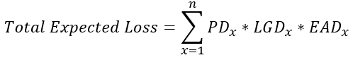

### Question 1: Comparing model reports

You've used logistic regression models and gradient boosted trees. It's time to compare these two to see which model will be used to make the final predictions.

One of the easiest first steps for comparing different models' ability to predict the probability of default is to look at their metrics from the classification_report(). With this, you can see many different scoring metrics side-by-side for each model. Because the data and models are normally unbalanced with few defaults, focus on the metrics for defaults for now.

The trained models clf_logistic and clf_gbt have been loaded into the workspace along with their predictions preds_df_lr and preds_df_gbt. A cutoff of 0.4 was used for each. The test set y_test is also available.

**Instructions**

1. Print the classification_report() for the logistic regression predictions.
2. Print the classification_report() for the gradient boosted tree predictions.
3. Print the macro average of the F-1 Score for the logistic regression using precision_recall_fscore_support().
4. Print the macro average of the F-1 Score for the gradient boosted tree using precision_recall_fscore_support().

**Pre Code**

```py
# Print the logistic regression classification report
target_names = ['Non-Default', 'Default']
print(____(____, ____['loan_status'], target_names=target_names))

# Print the gradient boosted tree classification report
print(____(____, ____['loan_status'], target_names=target_names))

# Print the default F-1 scores for the logistic regression
print(____(____,____['loan_status'], average = 'macro')[2])

# Print the default F-1 scores for the gradient boosted tree
print(____(____,____['loan_status'], average = 'macro')[2])
```

**Ans.**

```py
# Print the logistic regression classification report
target_names = ['Non-Default', 'Default']
print(classification_report(y_test, preds_df_lr['loan_status'], target_names=target_names))

# Print the gradient boosted tree classification report
print(classification_report(y_test, preds_df_gbt['loan_status'], target_names=target_names))

# Print the default F-1 scores for the logistic regression
print(precision_recall_fscore_support(y_test,preds_df_lr['loan_status'], average = 'macro')[2])

# Print the default F-1 scores for the gradient boosted tree
print(precision_recall_fscore_support(y_test,preds_df_gbt['loan_status'], average = 'macro')[2])
```

### Question 2: Comparing with ROCs

You should use ROC charts and AUC scores to compare the two models. Sometimes, visuals can really help you and potential business users understand the differences between the various models under consideration.

With the graph in mind, you will be more equipped to make a decision. The lift is how far the curve is from the random prediction. The AUC is the area between the curve and the random prediction. The model with more lift, and a higher AUC, is the one that's better at making predictions accurately.

The trained models clf_logistic and clf_gbt have been loaded into the workspace. The predictions for the probability of default clf_logistic_preds and clf_gbt_preds have been loaded as well.

**Instructions 1/2**

1. Calculate the fallout, sensitivity, and thresholds for the logistic regression and gradient boosted tree.
2. Plot the ROC chart for the lr then gbt using the fallout on the x-axis and sensitivity on the y-axis for each model.

**Pre Code**

```py
# ROC chart components
fallout_lr, sensitivity_lr, thresholds_lr = ____(____, ____)
fallout_gbt, sensitivity_gbt, thresholds_gbt = ____(____, ____)

# ROC Chart with both
plt.plot(____, ____, color = 'blue', label='%s' % 'Logistic Regression')
plt.plot(____, ____, color = 'green', label='%s' % 'GBT')
plt.plot([0, 1], [0, 1], linestyle='--', label='%s' % 'Random Prediction')
plt.title("ROC Chart for LR and GBT on the Probability of Default")
plt.xlabel('Fall-out')
plt.ylabel('Sensitivity')
plt.legend()
plt.show()
```

**Ans.**

```py
# ROC chart components
fallout_lr, sensitivity_lr, thresholds_lr = roc_curve(y_test, clf_logistic_preds)
fallout_gbt, sensitivity_gbt, thresholds_gbt = roc_curve(y_test, clf_gbt_preds)

# ROC Chart with both
plt.plot(fallout_lr, sensitivity_lr, color = 'blue', label='%s' % 'Logistic Regression')
plt.plot(fallout_gbt, sensitivity_gbt, color = 'green', label='%s' % 'GBT')
plt.plot([0, 1], [0, 1], linestyle='--', label='%s' % 'Random Prediction')
plt.title("ROC Chart for LR and GBT on the Probability of Default")
plt.xlabel('Fall-out')
plt.ylabel('Sensitivity')
plt.legend()
plt.show()
```

**Instructions 2/2**

1. Print the AUC for the logistic regression.
2. Print the AUC for the gradient boosted tree.

**Pre Code**

```py
# Print the logistic regression AUC with formatting
print("Logistic Regression AUC Score: %0.2f" % ____(____, ____))

# Print the gradient boosted tree AUC with formatting
print("Gradient Boosted Tree AUC Score: %0.2f" % ____(____, ____))
```

**Ans.**

```py
# Print the logistic regression AUC with formatting
print("Logistic Regression AUC Score: %0.2f" % roc_auc_score(y_test, clf_logistic_preds))

# Print the gradient boosted tree AUC with formatting
print("Gradient Boosted Tree AUC Score: %0.2f" % roc_auc_score(y_test, clf_gbt_preds))
```

### Question 3: Calibration curves

You now know that the gradient boosted tree clf_gbt has the best overall performance. You need to check the calibration of the two models to see how stable the default prediction performance is across probabilities. You can use a chart of each model's calibration to check this by calling the calibration_curve() function.

Calibration curves can require many lines of code in python, so you will go through each step slowly to add the different components.

The two sets of predictions clf_logistic_preds and clf_gbt_preds have already been loaded into the workspace. Also, the output from calibration_curve() for each model has been loaded as: frac_of_pos_lr, mean_pred_val_lr, frac_of_pos_gbt, and mean_pred_val_gbt.

**Instructions 1/3**

1. Create a calibration curve plot() by starting with the perfect calibration guideline and label it 'Perfectly calibrated'. Then add the labels for the y-axis and x-axis in order.

**Pre Code**

```py
# Create the calibration curve plot with the guideline
plt.____([0, 1], [0, 1], 'k:', label=____)    
plt.____('Fraction of positives')
plt.____('Average Predicted Probability')
plt.legend()
plt.title('Calibration Curve')
plt.____()
```

**Ans.**

```py
# Create the calibration curve plot with the guideline
plt.plot([0, 1], [0, 1], 'k:', label='Perfectly calibrated')    
plt.ylabel('Fraction of positives')
plt.xlabel('Average Predicted Probability')
plt.legend()
plt.title('Calibration Curve')
plt.show()
```

**Instructions 2/3**

1. Add a plot of the mean predicted values on the x-axis and fraction of positives on the y-axis for the logistic regression model to the plot of the guideline. Label this 'Logistic Regression'.

**Pre Code**

```py
# Add the calibration curve for the logistic regression to the plot
plt.plot([0, 1], [0, 1], 'k:', label='Perfectly calibrated')    
plt.plot(____, ____,
         's-', label='%s' % ____)
plt.ylabel('Fraction of positives')
plt.xlabel('Average Predicted Probability')
plt.legend()
plt.title('Calibration Curve')
plt.show()
```

**Ans.**

```py
# Add the calibration curve for the logistic regression to the plot
plt.plot([0, 1], [0, 1], 'k:', label='Perfectly calibrated')    
plt.plot(mean_pred_val_lr, frac_of_pos_lr,
         's-', label='%s' % 'Logistic Regression')
plt.ylabel('Fraction of positives')
plt.xlabel('Average Predicted Probability')
plt.legend()
plt.title('Calibration Curve')
plt.show()
```

**Instructions 3/3**

1. Finally, add a plot of the mean predicted values on the x-axis and fraction of positives on the y-axis for the gradient boosted tree to the plot. Label this 'Gradient Boosted tree'.

**Pre Code**

```py
# Add the calibration curve for the gradient boosted tree
plt.plot([0, 1], [0, 1], 'k:', label='Perfectly calibrated')    
plt.plot(mean_pred_val_lr, frac_of_pos_lr,
         's-', label='%s' % 'Logistic Regression')
plt.plot(____, ____,
         's-', label='%s' % ____)
plt.ylabel('Fraction of positives')
plt.xlabel('Average Predicted Probability')
plt.legend()
plt.title('Calibration Curve')
plt.show()
```

**Ans.**

```py
# Add the calibration curve for the gradient boosted tree
plt.plot([0, 1], [0, 1], 'k:', label='Perfectly calibrated')    
plt.plot(mean_pred_val_lr, frac_of_pos_lr,
         's-', label='%s' % 'Logistic Regression')
plt.plot(mean_pred_val_gbt, frac_of_pos_gbt,
         's-', label='%s' % 'Gradient Boosted Tree')
plt.ylabel('Fraction of positives')
plt.xlabel('Average Predicted Probability')
plt.legend()
plt.title('Calibration Curve')
plt.show()
```

### Question 4: Acceptance rates

Setting an acceptance rate and calculating the threshold for that rate can be used to set the percentage of new loans you want to accept. For this exercise, assume the test data is a fresh batch of new loans. You will need to use the quantile() function from numpy to calculate the threshold.

The threshold should be used to assign new loan_status values. Does the number of defaults and non-defaults in the data change?

The trained model clf_gbt and the data frame of it's predictions, test_pred_df, are a

**Instructions**

1. Print the summary statistics of prob_default within the data frame of predictions using .describe().
2. Calculate the threshold for a 85% acceptance rate using quantile() and store it as threshold_85.
3. Create a new column called pred_loan_status based on threshold_85.
4. Print the value counts of the new values in pred_loan_status.

**Pre Code**

```py
# Check the statistics of the probabilities of default
print(____[____].describe())

# Calculate the threshold for a 85% acceptance rate
____ = np.____(____['prob_default'], ____)

# Apply acceptance rate threshold
____[____] = ____[____].apply(lambda x: 1 if x > ____ else 0)

# Print the counts of loan status after the threshold
print(____[____].____())
```

**Ans.**

```py
# Check the statistics of the probabilities of default
print(test_pred_df['prob_default'].describe())

# Calculate the threshold for a 85% acceptance rate
threshold_85 = np.quantile(test_pred_df['prob_default'], 0.85)

# Apply acceptance rate threshold
test_pred_df['pred_loan_status'] = test_pred_df['prob_default'].apply(lambda x: 1 if x > threshold_85 else 0)

# Print the counts of loan status after the threshold
print(test_pred_df['pred_loan_status'].value_counts())
```

### Question 5: Visualizing quantiles of acceptance

You know how quantile() works to compute a threshold, and you've seen an example of what it does to split the loans into accepted and rejected. What does this threshold look like for the test set, and how can you visualize it?

To check this, you can create a histogram of the probabilities and add a reference line for the threshold. With this, you can visually show where the threshold exists in the distribution.

The model predictions clf_gbt_preds have been loaded into the workspace.

**Instructions**

1. Create a histogram of the predicted probabilities clf_gbt_preds.
2. Calculate the threshold for an acceptance rate of 85% using quantile(). Store this value as threshold.
3. Plot the histogram again, except this time add a reference line using .axvline().

**Pre Code**

```py
# Plot the predicted probabilities of default
plt.____(____, color = 'blue', bins = 40)

# Calculate the threshold with quantile
____ = np.____(____, ____)

# Add a reference line to the plot for the threshold
plt.____(x = ____, color = 'red')
plt.____()
```

**Ans.**

```py
# Plot the predicted probabilities of default
plt.hist(clf_gbt_preds, color = 'blue', bins = 40)

# Calculate the threshold with quantile
threshold = np.quantile(clf_gbt_preds, 0.85)

# Add a reference line to the plot for the threshold
plt.axvline(x = threshold, color = 'red')
plt.show()
```

### Question 6: Bad rates

With acceptance rate in mind, you can now analyze the bad rate within the accepted loans. This way you will be able to see the percentage of defaults that have been accepted.

Think about the impact of the acceptance rate and bad rate. We set an acceptance rate to have fewer defaults in the portfolio because defaults are more costly. Will the bad rate be less than the percentage of defaults in the test data?

The predictions data frame test_pred_df has been loaded into the workspace.

**Instructions**

1. Print the first five rows of the predictions data frame.
2. Create a subset called accepted_loans which only contains loans where the predicted loan status is 0.
3. Calculate the bad rate based on true_loan_status of the subset using sum() and .count()

**Pre Code**

```py
# Print the top 5 rows of the new data frame
print(____.____())

# Create a subset of only accepted loans
____ = ____[____['pred_loan_status'] == ____]

# Calculate the bad rate
print(np.____(____['true_loan_status']) / ____['true_loan_status'].____())
```

**Ans.**

```py
# Print the top 5 rows of the new data frame
print(test_pred_df.head())

# Create a subset of only accepted loans
accepted_loans = test_pred_df[test_pred_df['pred_loan_status'] == 0]

# Calculate the bad rate
print(np.sum(accepted_loans['true_loan_status']) / accepted_loans['true_loan_status'].count())
```

### Question 7: Acceptance rate impact

Now, look at the loan_amnt of each loan to understand the impact on the portfolio for the acceptance rates. You can use cross tables with calculated values, like the average loan amount, of the new set of loans X_test. For this, you will multiply the number of each with an average loan_amnt value.

When printing these values, try formatting them as currency so that the numbers look more realistic. After all, credit risk is all about money. This is accomplished with the following code:

pd.options.display.float_format = '${:,.2f}'.format
The predictions data frame test_pred_df, which now includes the loan_amnt column from X_test, has been loaded in the workspace.

**Instructions**

1. Print the summary statistics of the loan_amnt column using .describe().
2. Calculate the average value of loan_amnt and store it as avg_loan.
3. Set the formatting for pandas to '${:,.2f}'
4. Print the cross table of the true loan status and predicted loan status multiplying each by avg_loan.

**Pre Code**

```py
# Print the statistics of the loan amount column
print(____[____].____())

# Store the average loan amount
____ = np.____(____[____])

# Set the formatting for currency, and print the cross tab
pd.options.display.float_format = ____.format
print(pd.____(____[____],
                 ____[____]).apply(lambda x: x * ____, axis = 0))
```

**Ans.**

```py
# Print the statistics of the loan amount column
print(test_pred_df['loan_amnt'].describe())

# Store the average loan amount
avg_loan = np.mean(test_pred_df['loan_amnt'])

# Set the formatting for currency, and print the cross tab
pd.options.display.float_format = '${:,.2f}'.format
print(pd.crosstab(test_pred_df['true_loan_status'],
                 test_pred_df['pred_loan_status_15']).apply(lambda x: x * avg_loan, axis = 0))
```

### Question 8: Making the strategy table

Before you implement a strategy, you should first create a strategy table containing all the possible acceptance rates you wish to look at along with their associated bad rates and threshold values. This way, you can begin to see each part of your strategy and how it affects your portfolio.

Automatically calculating all of these values only requires a for loop, but requires many lines of python code. Don't worry, most of the code is already there. Remember the calculations for threshold and bad rate.

The array accept_rates has already been populated and loaded into the workspace along with the data frames preds_df_gbt and test_pred_df. The arrays thresholds and bad_rates have not been populated.

**Instructions 1/3**

1. Print the contents of accept_rates.

**Pre Code**

```py
# Print accept rates
print(____)
```

**Ans.**

```py
# Print accept rates
print(accept_rates)
```

**Instructions 2/3**

1. Populate the arrays thresholds and bad_rates using a for loop. Calculate the threshold thresh, and store it in thresholds. Then reassign the loan_status values using thresh. After that, Create accepted_loans where loan_status is 0.

**Pre Code**

```py
# Populate the arrays for the strategy table with a for loop
for rate in accept_rates:
    # Calculate the threshold for the acceptance rate
    thresh = np.____(preds_df_gbt[____], rate).round(3)
    # Add the threshold value to the list of thresholds
    thresholds.append(np.quantile(preds_df_gbt['prob_default'], rate).round(3))
    # Reassign the loan_status value using the threshold
    test_pred_df['pred_loan_status'] = test_pred_df['prob_default'].apply(lambda x: 1 if x > thresh else 0)
    # Create a set of accepted loans using this acceptance rate
    accepted_loans = test_pred_df[test_pred_df[____] == ____]
    # Calculate and append the bad rate using the acceptance rate
    bad_rates.append(np.____((accepted_loans[____]) / len(accepted_loans[____])).round(3))
```

**Ans.**

```py
# Populate the arrays for the strategy table with a for loop
for rate in accept_rates:
  	# Calculate the threshold for the acceptance rate
    thresh = np.quantile(preds_df_gbt['prob_default'], rate).round(3)
    # Add the threshold value to the list of thresholds
    thresholds.append(np.quantile(preds_df_gbt['prob_default'], rate).round(3))
    # Reassign the loan_status value using the threshold
    test_pred_df['pred_loan_status'] = test_pred_df['prob_default'].apply(lambda x: 1 if x > thresh else 0)
    # Create a set of accepted loans using this acceptance rate
    accepted_loans = test_pred_df[test_pred_df['pred_loan_status'] == 0]
    # Calculate and append the bad rate using the acceptance rate
    bad_rates.append(np.sum((accepted_loans['true_loan_status']) / len(accepted_loans['true_loan_status'])).round(3))
```

**Instructions 3/3**

1. Create the strategy table as a data frame and call it strat_df.
2. Print the contents of strat_df.

**Pre Code**

```py
# Create a data frame of the strategy table
____ = pd.____(zip(____, ____, ____),
                        columns = ['Acceptance Rate','Threshold','Bad Rate'])

# Print the entire table
print(____)
```

**Ans.**

```py
# Create a data frame of the strategy table
strat_df = pd.DataFrame(zip(accept_rates, thresholds, bad_rates),
                        columns = ['Acceptance Rate','Threshold','Bad Rate'])

# Print the entire table
print(strat_df)
```

### Question 9: Visualizing the strategy

Now you have the extended strategy table strat_df. The table is not so big that it's difficult to analyze, but visuals can help you see the overview all at once.

You should check at the distribution of each column with a box plot. If the distribution of Acceptance Rate looks the same as the Bad Rate column, that could be a problem. That means that the model's calibration is likely much worse than you thought.

You can also visualize the strategy curve with a line plot. The Acceptance Rate would be the independent variable with the Bad Rate as the dependent variable.

The strategy table strat_df has been loaded in the workspace.

**Instructions 1/2**

1. Create a simple boxplot of the values within strat_df using the pandas boxplot method.

**Pre Code**

```py
# Visualize the distributions in the strategy table with a boxplot
____.____()
plt.show()
```

**Ans.**

```py
# Visualize the distributions in the strategy table with a boxplot
strat_df.boxplot()
plt.show()
```

**Instructions 2/2**

1. Create a line plot of the acceptance rates on the x-axis and bad rates on the y-axis with a title(), xlabel(), and ylabel().

**Pre Code**

```py
# Plot the strategy curve
plt.plot(____[____], strat_df[____])
plt.____('Acceptance Rate')
plt.____('Bad Rate')
plt.____('Acceptance and Bad Rates')
plt.axes().yaxis.grid()
plt.axes().xaxis.grid()
plt.____()
```

**Ans.**

```py
# Plot the strategy curve
plt.plot(strat_df['Acceptance Rate'], strat_df['Bad Rate'])
plt.xlabel('Acceptance Rate')
plt.ylabel('Bad Rate')
plt.title('Acceptance and Bad Rates')
plt.axes().yaxis.grid()
plt.axes().xaxis.grid()
plt.show()
```

### Question 10: Estimated value profiling

The strategy table, strat_df, can be used to maximize the estimated portfolio value and minimize expected loss. Extending this table and creating some plots can be very helpful to this end.

The strat_df data frame is loaded and has been enhanced already with the following columns:

* Num Accepted Loans:	The number of accepted loans based on the threshold
* Avg Loan Amnt:	The average loan amount of the entire test set
* Estimated value:	The estimated net value of non-defaults minus defaults

**Instructions 1/3**

1. Check the contents of the new strat_df by printing the entire data frame.

**Pre Code**

```py
# Print the contents of the strategy df
print(____)
```

**Ans.**

```py
# Print the contents of the strategy df
print(strat_df)
```

**Instructions 2/3**

1. Create a line plot of the acceptance rate on the x-axis and estimated value from strat_df on the y-axis with axis labels for both x and y.

**Pre Code**

```py
# Create a line plot of estimated value
plt.____(____[____],____[____])
plt.title('Estimated Value by Acceptance Rate')
plt.____('Acceptance Rate')
plt.____('Estimated Value')
plt.axes().yaxis.grid()
plt.____()
```

**Ans.**

```py
# Create a line plot of estimated value
plt.plot(strat_df['Acceptance Rate'],strat_df['Estimated Value'])
plt.title('Estimated Value by Acceptance Rate')
plt.xlabel('Acceptance Rate')
plt.ylabel('Estimated Value')
plt.axes().yaxis.grid()
plt.show()
```

**Instructions 3/3**

1. Print the row with the highest 'Estimated Value' from strat_df.

**Pre Code**

```py
# Print the row with the max estimated value
print(strat_df.loc[____[____] == np.____(____[____])])
```

**Ans.**

```py
# Print the row with the max estimated value
print(strat_df.loc[strat_df['Estimated Value'] == np.max(strat_df['Estimated Value'])])
```

### Question 11: Total expected loss

It's time to estimate the total expected loss given all your decisions. The data frame test_pred_df has the probability of default for each loan and that loan's value. Use these two values to calculate the expected loss for each loan. Then, you can sum those values and get the total expected loss.



For this exercise, you will assume that the exposure is the full value of the loan, and the loss given default is 100%. This means that a default on each the loan is a loss of the entire amount.

The data frame test_pred_df has been loaded into the workspace.

**Instructions**

1. Print the top five rows of test_pred_df.
2. Create a new column expected_loss for each loan by using the formula above.
3. Calculate the total expected loss of the entire portfolio, rounded to two decimal places, and store it as tot_exp_loss.
4. Print the total expected loss.

**Pre Code**

```py
# Print the first five rows of the data frame
print(____.head())

# Calculate the bank's expected loss and assign it to a new column
____[____] = ____[____] * ____[____] * ____[____]

# Calculate the total expected loss to two decimal places
____ = round(np.____(____[____]),2)

# Print the total expected loss
print('Total expected loss: ', '${:,.2f}'.format(____))
```

**Ans.**

```py
# Print the first five rows of the data frame
print(test_pred_df.head())

# Calculate the bank's expected loss and assign it to a new column
test_pred_df['expected_loss'] = test_pred_df['prob_default'] * test_pred_df['loan_amnt'] * test_pred_df['loss_given_default']

# Calculate the total expected loss to two decimal places
tot_exp_loss = round(np.sum(test_pred_df['expected_loss']),2)

# Print the total expected loss
print('Total expected loss: ', '${:,.2f}'.format(tot_exp_loss))
```

<hr>