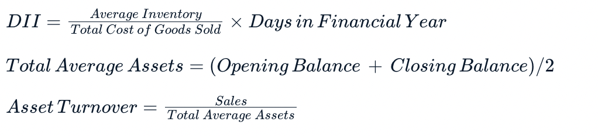

### Question 1: Calculating accounts receivable (debtors)

When we sell something on credit, the credit portion is in the balance sheet under ‘Accounts Receivable’ or ‘Debtors’. For example, if credit sales are made in January with a 60-day payback period, they would be recorded in our ‘Debtors’ account in January, but only be paid (released) in March, and so on.

In this exercise, we will create the following lists:

* The credit sales in the month credits, which in this exercise is 60% of the sale value.
* The total accounts receivable debtors, to be calculated as the credits for the current month, plus the credits of the month before, minus the credits of two months before (as we assume the credits from 2 months ago or 60 days, will be repaid by then).

We have set an index for the variable month. The month value is set at 0.

**Instructions**

1. Create a blank credits list and blank debtors list.
2. Complete the for loop:
    * Calculate the credit of the month by multiplying the sales value (set to variable mvalue) by the percentage credit (60%).
    * If the month is greater than 0, append the debtors as current month credits plus credits of prior month.
    * If the month is not greater than 0, append the debtors as the current month credits.
3. Print the debtors list.

**Pre Code**

```py
# Create the list for sales, and empty lists for debtors and credits
sales = [500, 350, 700]
____ = [] 
____ = []

# Create the statement to append the calculated figures to the debtors and credits lists
for mvalue in sales: 
    credits.append(mvalue * ____)
    if month > 0:
        ____.append(credits[____] + credits[month-1])
    else:
        ____.append(credits[____]) 
    month += 1
# Print the result
print("The ‘Debtors’ are {}.".format(_____))
```

**Ans.**

```py
# Create the list for sales, and empty lists for debtors and credits
sales = [500, 350, 700]
debtors = [] 
credits = []

# Create the statement to append the calculated figures to the debtors and credits lists
for mvalue in sales: 
    credits.append(mvalue * 0.6)
    if month > 0:
        debtors.append(credits[month] + credits[month-1]) 
    else:
        debtors.append(credits[month])
    month += 1
# Print the result
print("The ‘Debtors’ are {}.".format(debtors))
```

### Question 2: Bad debts

When offering credit terms to customers, there is always a risk that the customer does not pay their debt. In the finance world, this is known as "bad debts".

As we have already recorded sales, we need to record the loss of sales now, as we never received the payment.

This affects both the income statement and the balance sheet. In the income statement, we record a negative value in the sales for the month we write off the debt. In the balance sheet, we need to reduce our debtor’s asset.

The following variables have been defined for January: debtors_jan = 1500

In February, we received news that a customer has gone into liquidation. This customer currently owes 500 USD.

We expect to recover 70% of this amount; the rest has to be written off as bad debts.

**Instructions**

1. Calculate the bad debts amount for February.
2. Reduce the debtors' value by the amount in bad_debts_feb.
3. Print the bad debts for February.
4. Print the new debtors' value debtors_feb.

**Pre Code**

```py
# Calculate the bad debts for February
bad_debts_feb = ____*____

# Calculate the feb debtors amount
debtors_feb = (____ - ____)

# Print the debtors for January and the bad debts and the debtors for February
print("The debtors are {} in January, {} in February. February's bad debts are {} USD.".format(____, ____, ____))
```

**Ans.**

```py
# Calculate the bad debts for February
bad_debts_feb = 500*0.3

# Calculate the feb debtors amount
debtors_feb = (debtors_jan - bad_debts_feb)

# Print the debtors for January and the bad debts and the debtors for February
print("The debtors are {} in January, {} in February. February's bad debts are {} USD.".format(debtors_jan, debtors_feb, bad_debts_feb))
```

### Question 3: Calculating accounts payable (creditors)

Now we will look at a scenario where we are the ones being granted credit. This means that we can buy something, but only have to pay for this amount later.

In this exercise, T-Z needs to buy nuts and bolts to produce 1000 units in January and 1200 units in February. The cost of nuts and bolts per unit is 0.25 USD. The credit terms are 50% cash upfront and 50% in 30 days.

Therefore, the creditors' value, in this case, would be paid the month directly after. This means that the creditors' value would only reflect the current month's credit purchases.

**Instructions**

1. Set the cost per unit.
2. Create the list for production production including the unit amounts for January and February, as well as an empty creditors list.
3. Calculate the accounts payable creditors for January and February.
    * To do this, use the .append() method for each quantity of units (mvalue) in production, multiplied by the unit cost and credit terms (0.5).
4. Print the creditors balance for January and February.

**Pre Code**

```py
# Set the cost per unit
unit_cost = ____

# Create the list for production units and empty list for creditors
production = [____,____]
creditors = ____

# Calculate the accounts payable for January and February
for mvalue in ____: 
    creditors.____(mvalue * ____ * 0.5)
    
# Print the creditors balance for January and February
print("The creditors balance for January and February are {} and {} USD.".format(____[0], ____[1]))
```

**Ans.**

```py
# Set the cost per unit
unit_cost = 0.25

# Create the list for production units and empty list for creditors
production = [1000,1200]
creditors = []

# Calculate the accounts payable for January and February
for mvalue in production: 
    creditors.append(mvalue * unit_cost * 0.5)
    
# Print the creditors balance for January and February
print("The creditors balance for January and February are {} and {} USD.".format(creditors[0], creditors[1]))
```

### Question 4: Understanding accounts payable and receivable

We have gone through some exercises on accounts payable and receivable (creditors and debtors). Now we will test your understanding of these concepts.

T-Z is a successful company producing custom T-shirts. Their balance sheet for the past three months broken down by month looks as follows:

| Balance Sheet Item |	January	| February |	March |
| --- | --- | --- | --- |
| Accounts Receivables\Debtors |   	1000  |	750 |	750 |
| Accounts Payables\Creditors	| 300 |	600 |	900 |
| Bad Debts |	0 |	250 |	0 |

Choose the most likely analysis of these balances.

1. T-Z has a large debtors balance, but has received payment in February, the creditors have also been increasing each month, which could indicate a longer payback period.
2. T-Z has not reduced their debtors' balance but has written off some bad debts in February, which needs monitoring. The creditors are increasing, which is good for cash flow.
3. T-Z has increased debtors, which is good for cash flow. However, the creditors and bad debts are growing, which could be a risk.

**Ans.** 2

### Question 5: Debtor days ratio

The first ratio we will look at is debtor days. This ratio looks at how many days it takes to receive our money from our debtors. It is usually calculated over a period of 1 financial year.

The following information is available to you:

Sales for the year: 12,500 USD
Ending Debtors balance: 650

**Instructions**

1. Create the variables for the ending debtors balance debtors_end, and the total sales for the year sales_tot.
2. Calculate the debtor days ratio ddays_ratio.
3. Print the result.

**Pre Code**

```py
# Create the variables
____ = ____
____ = ____

# Calculate the debtor days variable
____ = (____/____) * 365

# Print the result
print("The debtor days ratio is {}.".format(____))
```

**Ans.**

```py
# Create the variables
debtors_end = 650
sales_tot = 12500

# Calculate the debtor days variable
ddays_ratio = (debtors_end/sales_tot) * 365

# Print the result
print("The debtor days ratio is {}.".format(ddays_ratio))
```

### Question 6: Days payable outstanding

We will now have a look at our accounts payable, or creditors, and a ratio called the Days Payable Outstanding (DPO).

This ratio is an efficiency ratio that measures the average number of days a company takes to pay its suppliers.

T-Z wants to know its days payable outstanding and has asked you to calculate it.

The following is available in the workspace:

* Total COGS for the period = 4000
* Closing Payables balance = 650

**Instructions**

1. Set the variables for cogs_tot and closing balance creditors creditors_end.
2. Calculate the Days Payable Outstanding dpo.
3. Print the dpo.

**Pre Code**

```py
# Get the variables
cogs_tot = ____
____ = 650

# Calculate the days payable outstanding
____ = (____/____)*365

# Print the days payable outstanding
print("The days payable outstanding is {}.".format(dpo))
```

**Ans.**

```py
# Get the variables
cogs_tot = 4000
creditors_end = 650

# Calculate the days payable outstanding
dpo = (creditors_end/cogs_tot)*365

# Print the days payable outstanding
print("The days payable outstanding is {}.".format(dpo))
```

### Question 7: Days in inventory and asset turnover ratio

In this exercise, we will calculate the time it takes for a company to turn inventory into sales (days in inventory or DII ratio) and a ratio to calculate the efficiency of a company’s assets by seeing how the company uses its assets to generate sales (asset turnover ratio). The required formulas are:



The following are preloaded:

| Metric | Variable | Value |
| --- | --- | --- |
| Total COGS | cogs_tot |	4000 |
| Average Inventory |	av_inv |	1900 |
| Total Sales |	sales_tot |	10000 |
| Opening balance Assets |	ob_assets |	2000 |
| Closing balance Assets |	cb_assets |	7000 |

**Instructions 1/2**

1. Calculate the DII ratio dii_ratio for T-Z and print the result.

**Pre Code**

```py
# Calculate the dii ratio 
____ = (____/____)*365

# Print the result
print("The DII ratio is {}.".format(____))
```

**Ans.**

```py
# Calculate the DII Ratio
dii_ratio = (av_inv/cogs_tot)*365

# Print the result
print("The DII ratio is {}.".format(dii_ratio))
```

**Instructions 2/2**

1. Calculate the average assets av_assets.
2. Calculate the asset turnover ratio and print the result.

**Pre Code**

```py
# Calculate the DII Ratio
dii_ratio = (av_inv/cogs_tot)*365

# Print the result
print("The DII ratio is {}.".format(dii_ratio))

# Calculate the Average Assets
av_assets = (____ + ____)/2

# Calculate the Asset Turnover Ratio
at_ratio = ____/____

# Print the Asset Turnover Ratio
print("The asset turnover ratio is {}.".format(____))
```

**Ans.**

```py
# Calculate the DII Ratio
dii_ratio = (av_inv/cogs_tot)*365

# Print the result
print("The DII ratio is {}.".format(dii_ratio))

# Calculate the Average Assets
av_assets = (ob_assets + cb_assets)/2

# Calculate the Asset Turnover Ratio
at_ratio = sales_tot/av_assets

# Print the Asset Turnover Ratio
print("The asset turnover ratio is {}.".format(at_ratio))
```

### Question 8: Understanding ratios

T-Z has decided to do a comparison and analysis between their company, and a competitor, ShirtCo. Below is the information collected:

| Ratio	| T-Z	| ShirtCo |
| --- | --- | --- |
| Debtor Days Ratio |	17.5 | 6.8 |
| Days Payable Outstanding |	59 |	91 |
| Inventory Days Ratio |	171 |	205 |
| Asset Turnover |	1.1 |	9.5 |

What conclusion could T-Z come to based on this comparison?

1. T-Z takes longer to collect cash from their debtors, but is more efficient in managing their inventory than ShirtCo.
2. T-Z manages their creditors better than ShirtCo.
3. ShirtCo is more efficient to collect cash from debtors but needs a higher investment in assets than T-Z.
4. ShirtCo requires a lower investment in assets than T-Z and also has lower days in inventory than T-Z.

**Ans.** 1

### Question 9: Calculating balance sheet ratios for Ford

Now we will look at a real life example, Ford Inc, a company producing motor vehicles. We have uploaded a dataset: balance_sheet with the data for Ford Inc's most recent balance sheet. The sales and cost of sales figures have been provided for 2017 with the Key_Figures_Memodataset.

We are only interested in one line on the balance sheet, the Receivables (another name for Debtors), and therefore need to create a filter for this. In this exercise, we will use boolean indexing to filter our dataset for Receivables in the metric column. We will first specify our metric of interest ('Receivables'), and then check whether the column of interest has this value in each row. This will generate a boolean series of True and False values. With this series, we can then filter our existing dataset.

Once we have filtered our dataset, we can retrieve the receivables values from the most recent time period and calculate the debtor days ratio.

The balance_sheet and sales figures are provided.

**Instructions 1/2**

1. Set the receivables_metric to a list containing 'Receivables'.
2. Using the method .isin(), create a boolean series receivables_filter, based on whether each row in the column metric contains receivables_metric.
3. Use this series to filter balance_sheet, assigning the result to filtered_balance_sheet.

**Pre Code**

```py
# Create the filter metric for Receivables
receivables_metric = ____

# Create a boolean series with your metric
receivables_filter = balance_sheet.____.____(____)

# Use the series to filter the dataset
filtered_balance_sheet = ____[____]
```

**Ans.**

```py
# Create the filter metric for Receivables
receivables_metric = ['Receivables']

# Create a boolean series with your metric
receivables_filter = balance_sheet.metric.isin(receivables_metric)

# Use the series to filter the dataset
filtered_balance_sheet = balance_sheet[receivables_filter]
```

**Instructions 2/2**

1. Get the receivables values from the latest time period. That is, select the 2017-12 column from filtered_balance_sheet and use iloc[] to extract the zeroth value.
2. Calculate the debtor days ratio using given the formula in the exercise text.

**Pre Code**

```py
# From previous step
receivables_metric = ['Receivables']
receivables_filter = balance_sheet.metric.isin(receivables_metric)
filtered_balance_sheet = balance_sheet[receivables_filter]

# Extract the zeroth value from the last time period (2017-12)
debtors_end = filtered_balance_sheet[____].____[0]

# Calculate the debtor days ratio
ddays = (____ / ____) * 365

# Print the debtor days ratio
print("The debtor day ratio is {:.0f}. A higher debtors days ratio means it takes longer to collect cash from debtors.".format(ddays))
```

**Ans.**

```py
# From previous step
receivables_metric = ['Receivables']
receivables_filter = balance_sheet.metric.isin(receivables_metric)
filtered_balance_sheet = balance_sheet[receivables_filter]

# Extract the zeroth value from the last time period (2017-12)
debtors_end = filtered_balance_sheet["2017-12"].iloc[0]

# Calculate the debtor days ratio
ddays = (debtors_end / sales) * 365

# Print the debtor days ratio
print("The debtor day ratio is {:.0f}. A higher debtors days ratio means it takes longer to collect cash from debtors.".format(ddays))
```

### Question 10: Forecasting the balance sheet for Ford

Now that we have the ratios for Ford, the management wishes to improve them for the 2018 financial year.

There is one ratio in particular that management would like to be improved – the debtor days ratio, which is currently sitting at 146 days, while better than Nissan (244 days), is still much higher than Toyota, the industry leader (31 days).

Management would like to bring the debtor days down to below 100 days.

These variables have already been set:

* filtered_balance_sheet contains the receivables row of the balance sheet.
* ddays = 99 is the target debtor days.
* sales = 156776 is the existing sales total.

**Instructions 1/2**

1. Sales are expected to increase by 10%. Calculate these forecasted sales, f_sales from the existing sales.
2. Rearrange the debtor days formula to calculate the closing balance of debtors needed to achieve 99 debtor days.

**Pre Code**

```py
# Calculate the forecasted sales 
f_sales = ____ * ____

# Solve for the forecasted debtors' ending balance
f_debtors_end = ____ * ____ / 365

print("If sales rise by 10% and the debtor days decrease to {:.0f} then the forecasted closing balance for debtors will be {:.0f}.".format(ddays, ____))
```

**Ans.**

```py
# Calculate the forecasted sales 
f_sales = sales * 1.10

# Solve for the forecasted debtors' ending balance
f_debtors_end = ddays * f_sales / 365

print("If sales rise by 10% and the debtor days decrease to {:.0f} then the forecasted closing balance for debtors will be {:.0f}.".format(ddays, f_debtors_end))
```

**Instructions 2/2**

1. Get the number of columns of filtered_balance_sheet using thelen()function.
2. Using the insert()function, insert new column Forecastafter the last column of filtered_balance_sheet, containing the forecast debtors end balance, f_debtors_end.

**Pre Code**

```py
# From previous step
f_sales = sales * 1.10
f_debtors_end = ddays * f_sales / 365

# Get the number of columns in the filtered balance sheet
n_cols = ____(____.____)

# Append a Forecast column of the forecasted debtors' end balance
filtered_balance_sheet.____(____, '____', ____)

# See the result
print(filtered_balance_sheet)
```

**Ans.**

```py
# From previous step
f_sales = sales * 1.10
f_debtors_end = ddays * f_sales / 365

# Get the number of columns in the filtered balance sheet
n_cols = len(filtered_balance_sheet.columns)

# Append a Forecast column of the forecasted debtors' end balance
filtered_balance_sheet.insert(n_cols, 'Forecast', f_debtors_end)

# See the result
print(filtered_balance_sheet)
```

<hr>