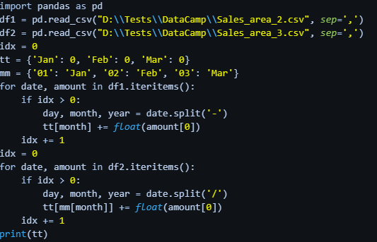

### Question 1: Converting quarters into months

A company has a challenge in separating data into months. It has received the following data:

| Quarter	| Amount |
| --- | --- |
| Quarter 1	| 700 |
| Quarter 2	| 650 |

The split across the months within each quarter is equal. Your goal is to separate this data into a list format containing the amounts per month for the first two quarters.

**Instructions**

1. Create a list for quarters containing the numerical units per quarter, and initialize a new empty list qrtlist. The latter step has been done for you.
2. Create a for loop that converts the qrt in the quarters list into months with the formula round(qrt/3, 2). The round() function with the second argument 2 rounds the numbers down to a readable format.
3. Add the three equal values of month to qrtlist.
4. Print the qrtlist.

**Pre Code**

```py
# Create a list for quarters and initialize an empty list qrtlist
quarters = [____, 650]
qrtlist = []

# Create a for loop to split the quarters into months and add to qrtlist
for qrt in ____:
 month = round(____ / 3, 2)
 qrtlist = qrtlist + [____, ____, ____]
 
# Print the result
print("The values per month for the first two quarters are {}.".format(____))
```

**Ans.**

```py
# Create a list for quarters and initialize an empty list qrtlist
quarters = [700, 650]
qrtlist = []

# Create a for loop to split the quarters into months and add to qrtlist
for qrt in quarters:
 month = round(qrt / 3, 2)
 qrtlist = qrtlist + [month, month, month]

# Print the result
print("The values per month for the first two quarters are {}.".format(qrtlist))
```

### Question 2: Merging months into quarters

Now we saw what to do when we wanted to split quarters into months for more detailed monthly information. But what happens when the opposite is true and we wish to combine data into fewer columns? This is typical when dealing with historical data, when monthly details may not be necessary, or when we need a highly consolidated version of the data for a report.

The key here is to create an index, and then only add to the quarter total quarter in cycles of 3, or until the length of the list. We can do this with the following code:

if index % 3 == 0 or index == len(months):

This code checks whether the index divided by three yields a remainder of 0, or if the index is at the end of the list months. Thus, in a loop it will execute the specified code every three months or when it reaches the end of the list.

The monthly sales are already provided in the code as months, containing the sales from the first two quarters, as well as the first month of Q3. Your task is to generate a new list called quarters that contains the quarterly totals from the first three months (which includes the partial total of Q3).

**Instructions**

1. Initialize an empty list quarters to contain the new quarterly values, and an index variable index set to 1.
2. Create a for loop to find the monthly sales in months:
    * Add the monthly sales to quarter.
    * If it's the end of the quarter or the end of the list months, append your quarterly total to quarters.
    * Reset the quarterly total quarter to 0, increment the index by 1 (this has been done for you).
3. Print the quarterly totals.

**Pre Code**

```py
# Create a months list, as well as an index, and set the quarter to 0
months = [100, 100, 150, 250, 300, 10, 20]
quarter = 0
____ = ____
____ = ____

# Create for loop for quarter, print result, and increment the index
for sales in months:
    quarter += ____
    if index % ____ == ____ or index == len(____):
        ____.append(____)
        quarter = 0
    index = index + 1
    
print("The quarter totals are Q1: {}, Q2: {}, Q3: {}".format(quarters[0], ____, ____))
```

**Ans.**

```py
# Create a months list, as well as an index, and set the quarter to 0
months = [100, 100, 150, 250, 300, 10, 20]
quarter = 0
quarters = []
index = 1

# Create for loop for quarter, print result, and increment the index
for sales in months:
    quarter += sales
    if index % 3 == 0 or index == len(months):
        quarters.append(quarter)
        quarter = 0
    index = index + 1
    
print("The quarter totals are Q1: {}, Q2: {}, Q3: {}".format(quarters[0], quarters[1], quarters[2]))
```

### Question 3: Working with the datetime library

We will be exploring the datetime library, specifically the datetime.strptime(date_string, format) method that converts a string date in a specific string format by identifying day, month and year. Using the table provided, determine the appropriate code to identify the year, month, and day from the dates below (you can check your answers by printing the method in the console):
* 12-01-1990 (US Format m-d-y)
* 23/08/2020 (EU Format d-m-y)

| Directive |	Meaning |	Example |
| --- | --- | --- |
| %d | Day of the month as a zero-padded decimal number |	01, 02, …, 31 |
| %b |	Month as locale’s abbreviated name |	Jan, Feb, …, Dec |
| %B |	Month as locale’s full name |	January, …, December |
| %m |	Month as a zero-padded decimal number |	01, 02, …, 12 |
| %y | Year without century as a zero-padded decimal number |	00, 01, …, 99 |
| %Y |	Year with century as a decimal number |	1970, 1988, 2001, 2013 |

1. Use datetime.strptime('12-01-1990', '%m %d %Y') 
2. Use datetime.strptime('12-01-1990', '%m-%d-%Y') 
3. Use datetime.strptime('12-01-1990', '%m/%d/%Y')

**Ans.** 2

### Question 4: Converting date formats - simple

Sales area A in Europe and Sales area B in Australia have different date formats.

Sale A: 4000 on 14/02/2018
Sale B: 3000 on 2 March 2018

If we want to consolidate or compare sales periods, we need to convert to the same date format.

**Instructions**

1. Import the datetime library.
2. Create a dt_object that converts the dates of each sale into a standardized format of day-month-year.
3. Print each result to compare

**Pre Code**

```py
# Import the datetime python library
from ____ import ____

# Create a dt_object to convert the first date and print the month result
dt_object1 = datetime.strptime('14/02/2018', '____')
print(____)

# Create a dt_object to convert the second date and print the month result
dt_object2 = datetime.strptime('2 March 2018', '____')
print(____)
```

**Ans.**

```py
# Import the datetime python library
from datetime import datetime

# Create a dt_object to convert the first date and print the month result
dt_object1 = datetime.strptime('14/02/2018', '%d/%m/%Y')
print(dt_object1)

# Create a dt_object to convert the second date and print the month result
dt_object2 = datetime.strptime('2 March 2018', '%d %B %Y')
print(dt_object2)
```

### Question 5: Converting date formats - explicit

Let's have a look at one of the dates from the previous exercise.

Sale A: 4000 on 14/02/2018
We used the datetime library to identify the day d, month m, and year y which could help us to identify data from datasets with different date formats. However, what about a scenario where we want to convert date formats into a specific format?

In this exercise you will convert Sale A from the format 14/02/2018 to the same date format as Sale B (i.e. 14 February 2018).

We can do this easily with built-in Python functions. Remember, to split a string we can use the .split()method.

The input for this exercise will be the datetime of Sale A.

**Instructions**

1. Create a variable dt which contains a string representation of the date you want to convert to a new format (i.e. Sale A).
2. Create a dictionary for the months mm, which will specify which month corresponds to which number, in the format {'number':'month name'}.
3. Split the dt string by the character / and assign values to the day, month and year variables.
4. Print the results by concatenating a string using the dictionary for the given month into the new format.

**Pre Code**

```py
# Set the variable for the datetime to convert
dt = '____'

# Create the dictionary for the month values
mm = {'01': '____', '____': 'February', '____': '____'}

# Split the dt string into the different parts
____, ____, year = dt.split('____')

# Print the concatenated date string
print(____ + ' ' + ____[____] + ' ' + ____)
```

**Ans.**

```py
# Set the variable for the datetime to convert
dt = '14/02/2018'

# Create the dictionary for the month values
mm = {'01': 'January', '02': 'February', '03': 'March'}

# Split the dt string into the different parts
day, month, year = dt.split('/')

# Print the concatenated date string
print(day + ' ' + mm[month] + ' ' + year)
```

### Question 6: Working with datasets - month totals

In this exercise, we will be exploring a dataset that has multiple sales in one month. We will create a script that will enable us to identify dates within the same month, and combine them into a new month total, and append this to the table.

We will be using the dataset df, which represents data from one of our sales areas. Print it out in the console to have a look at the data. As you can see, there were two sales in March. We will combine these sales into a single month total. We can iterate over the dataset using the .iteritems() method.

We will also be using the .split() method.

**Instructions 1/2**

1. Set index to 0, and create a dictionary for the relevant months, called tt in the following format: {'Month': 0,} for Jan, Feb, and Mar.

**Pre Code**

```py
# Set the index to start at 0
index = ____

# Create the dictionary for the months
tt = {'____': 0, 'Feb': ____, '____': ____}
```

**Ans.**

```py
# Set the index to start at 0
index = 0 

# Create the dictionary for the months
tt = {'Jan': 0, 'Feb': 0, 'Mar': 0}
```

**Instructions 2/2**

1. Create a for loop that iterates the date and amount items in df.
2. Create an if statement that specifies splitting the day and month variables using a hyphen (-).
3. Combine the tt value of [month] plus the float(amount[0]) and print tt.

**Pre Code**

```py
# Set the index to start at 0
index = 0 

# Create the dictionary for the months
tt = {'Jan': 0, 'Feb': 0, 'Mar': 0}

# Create a for loop that will iterate the date and amount values in the dataset
for date, amount in df.____:
    # Create the if statement to split the day and month, then add it to the new tt variable
    if index > 0: 
        day, month = date.split('____')
        tt[____] +=float(____[0])
    index += 1

print(____)
```

**Ans.**

```py
# Set the index to start at 0
index = 0 

# Create the dictionary for the months
tt = {'Jan': 0, 'Feb': 0, 'Mar': 0}

# Create a for loop that will iterate the date and amount values in the dataset
for date, amount in df.iteritems():
    # Create the if statement to split the day and month, then add it to the new tt variable
    if index > 0: 
        day, month = date.split('-')
        tt[month] +=float(amount[0])
    index += 1 

print(tt)
```

### Question 7: Working with datasets - combining datasets

In this example, we will be working with two datasets, df1 and df2. You can print these both out in the console to see what they contain. You will notice that they contain different date formatting.

More specifically, df1 specifies the month by the name (e.g. 02-Feb-18), whereas df2 specifies the month numerically (e.g. 06/01/2018). Additionally, df1 uses a hyphen (-) as a separator, whereas df2 uses a forward slash (/) as a separator.

We will be combining these two datasets to form a consolidated forecast for the quarter. To do this, we will need to parse the different date formats of df1 and df2.

**Instructions 1/3**

1. Start by creating the following dictionaries:
    * totals, which is an empty dictionary containing the totals for each month initialized to 0.
    * calendar, which is a dictionary containing the months (Jan, Feb, Mar) and corresponding numbers.

**Pre Code**

```py
____ = {'Jan': 0, 'Feb': 0, 'Mar': 0}
calendar = {'01': '____', '02': '____', '03': '____'}
```

**Ans.**

```py
totals = {'Jan': 0, 'Feb': 0, 'Mar': 0}
calendar = {'01': 'Jan', '02': 'Feb', '03': 'Mar'}
```

**Instructions 2/3**

1. Create a for loop to iterate over the items in the first dataset df1.
    * Using .iteritems(), iterate over the date and amount values in each column.
    * Using date.split(), specify the correct split separator (i.e., - or /).

**Pre Code**

```py
totals = {'Jan': 0, 'Feb': 0, 'Mar': 0}
calendar = {'01': 'Jan', '02': 'Feb', '03': 'Mar'}

for ____, ____ in df1.iteritems():
        day, month, year = date.split('____')
        totals[month] +=float(amount[0]) 
```

**Ans.**

```py
totals = {'Jan': 0, 'Feb': 0, 'Mar': 0}
calendar = {'01': 'Jan', '02': 'Feb', '03': 'Mar'}

for date, amount in df1.iteritems():
	day, month, year = date.split('-')
	totals[month] +=float(amount[0]) 
```

**Instructions 3/3**

1. Repeat the process for df2, this time converting the numerical month format to match your totals dictionary.
    * This time month will yield a a numerical reference, so we will need to use our calendar dictionary to add the amount to our totals dictionary.

**Pre Code**

```py
totals = {'Jan': 0, 'Feb': 0, 'Mar': 0}
calendar = {'01': 'Jan', '02': 'Feb', '03': 'Mar'}

for date, amount in df1.iteritems():
        day, month, year = date.split('-')
        totals[month] +=float(amount[0]) 

for date, amount in df2.____():
        day, month, year = ____.____('/')
        totals[____[____]] += float(amount[0])

print(totals)
```

**Ans.**

```py
totals = {'Jan': 0, 'Feb': 0, 'Mar': 0}
calendar = {'01': 'Jan', '02': 'Feb', '03': 'Mar'}

for date, amount in df1.iteritems():
        day, month, year = date.split('-')
        totals[month] +=float(amount[0]) 

for date, amount in df2.iteritems():
        day, month, year = date.split('/')
        totals[calendar[month]] += float(amount[0])

print(totals)
```

### Question 8: Working with datasets - exporting data

Consider the following code:



Which additional lines need to be added to transform the totals dictionary to a DataFrame, and write that DataFrame to a CSV file?

1. rf = pd.DataFrame.from_dict(mm, orient="index"); rf.to_csv("LocalDrive\\Sales.csv")
2. rf = pd.DataFrame.from_dict(tt, orient="index"); rf.to_csv("LocalDrive\\Sales.csv")
3. rf = pd.DataFrame.from_dict(tt, orient="index"); rf.tocsv("LocalDrive\\Sales.csv")

**Ans.** 2

<hr>