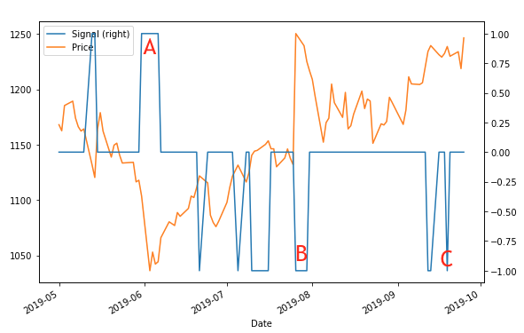

### Question 1: Understand trading signals

A trading strategy is a method of buying and selling financial assets based on predefined rules. The rules can be set based on trading signals.

Which of the following statements is incorrect?

1. Trading signals are triggers to long or short financial assets based on predetermined criteria.
2. Trading signals predict the direction of future price movement.
3. A trading signal can be constructed using one technical indicator, multiple technical indicators, or a combination of market data and indicators.
4. Trading signals are commonly used in algorithmic trading.

**Ans.** 2 

### Question 2: Build an SMA-based signal strategy

It's time to build and backtest your first signal-based strategy. Although simple, these types of strategies can be effective, and also lay the groundwork for more complex strategies consisting of additional signals and information.

Implementing a price-comparison-based signal with bt is a straightforward process. You will first download some historical price data of the stock, calculate its SMA (simple moving average), implement an SMA-based signal strategy, and then backtest it with the stock price data.

The bt package has been imported for you. The historical price data of the Apple stock has been preloaded in price_data.

**Instructions 1/3**

1. Calculate the 20-day SMA of price_data.

**Pre Code**

```py
# Calculate the SMA
sma = price_data.____
```

**Ans.**

```py
# Calculate the SMA
sma = price_data.rolling(20).mean()
```

**Instructions 2/3**

1. Define the strategy using a comparison between price_data and sma.

**Pre Code**

```py
# Calculate the SMA
sma = price_data.rolling(20).mean()

# Define the strategy
bt_strategy = bt.Strategy('AboveSMA', 
                          [____,
                           bt.algos.WeighEqually(),
                           bt.algos.Rebalance()])
```

**Ans.**

```py
# Calculate the SMA
sma = price_data.rolling(20).mean()

# Define the strategy
bt_strategy = bt.Strategy('AboveSMA', 
                          [bt.algos.SelectWhere(price_data > sma),
                           bt.algos.WeighEqually(),
                           bt.algos.Rebalance()])
```

**Instructions 3/3**

1. Create a backtest with bt_strategy and price_data, and run it.
2. Plot the backtest result.

**Pre Code**

```py
# Calculate the SMA
sma = price_data.rolling(20).mean()

# Define the strategy
bt_strategy = bt.Strategy('AboveSMA', 
                          [bt.algos.SelectWhere(price_data > sma),
                           bt.algos.WeighEqually(),
                           bt.algos.Rebalance()])

# Create the backtest and run it
bt_backtest = ____(____, price_data)
bt_result = ____(bt_backtest)
# Plot the backtest result
____(title='Backtest result')
plt.show()
```

**Ans.**

```py
# Calculate the SMA
sma = price_data.rolling(20).mean()

# Define the strategy
bt_strategy = bt.Strategy('AboveSMA', 
                          [bt.algos.SelectWhere(price_data > sma),
                           bt.algos.WeighEqually(),
                           bt.algos.Rebalance()])

# Create the backtest and run it
bt_backtest = bt.Backtest(bt_strategy, price_data)
bt_result = bt.run(bt_backtest)
# Plot the backtest result
bt_result.plot(title='Backtest result')
plt.show()
```

### Question 3: Build an EMA-based signal strategy

Previously, you implemented an SMA-based signal strategy. However, you are wondering whether the EMA (exponential moving average) indicator is a better choice since it is more sensitive to recent price movement. You also would like to leverage the talib library to calculate the indicator. After switching to an EMA-based signal strategy, you will perform a similar backtest using the Apple stock price data.

The bt and talib packages have been imported for you. Also, the historical price data of the Apple stock has been preloaded in price_data.

**Instructions 1/3**

1. Calculate the 20-day EMA of the Close price with the appropriate talib function.

**Pre Code**

```py
# Calculate the EMA
ema['Close'] = ____(price_data['Close'], ____)
```

**Ans.**

```py
# Calculate the EMA
ema['Close'] = talib.EMA(price_data['Close'], timeperiod=20)
```

**Instructions 2/3**

1. Define the strategy with a price_data and ema comparison.

**Pre Code**

```py
# Calculate the EMA
ema['Close'] = talib.EMA(price_data['Close'], timeperiod=20)

# Define the strategy
bt_strategy = bt.Strategy('AboveEMA',
                          [____,
                           bt.algos.WeighEqually(),
                           bt.algos.Rebalance()])
```

**Ans.**

```py
# Calculate the EMA
ema['Close'] = talib.EMA(price_data['Close'], timeperiod=20)

# Define the strategy
bt_strategy = bt.Strategy('AboveEMA',
                          [bt.algos.SelectWhere(price_data > ema),
                           bt.algos.WeighEqually(),
                           bt.algos.Rebalance()])
```

**Instructions 3/3**

1. Create a backtest with bt_strategy and price_data, and run it.
2. Plot the backtest result.

**Pre Code**

```py
# Calculate the EMA
ema['Close'] = talib.EMA(price_data['Close'], timeperiod=20)

# Define the strategy
bt_strategy = bt.Strategy('AboveEMA',
                          [bt.algos.SelectWhere(price_data > ema),
                           bt.algos.WeighEqually(),
                           bt.algos.Rebalance()])

# Create the backtest and run it
bt_backtest = ____(____, ____)
bt_result = ____(____)
# Plot the backtest result
____(title='Backtest result')
plt.show()
```

**Ans.**

```py
# Calculate the EMA
ema['Close'] = talib.EMA(price_data['Close'], timeperiod=20)

# Define the strategy
bt_strategy = bt.Strategy('AboveEMA',
                          [bt.algos.SelectWhere(price_data > ema),
                           bt.algos.WeighEqually(),
                           bt.algos.Rebalance()])

# Create the backtest and run it
bt_backtest = bt.Backtest(bt_strategy, price_data)
bt_result = bt.run(bt_backtest)
# Plot the backtest result
bt_result.plot(title='Backtest result')
plt.show()
```

### Question 4: Construct an EMA crossover signal

Trend-following strategies believe that "the trend is your friend," and use signals to indicate the trend and profit by riding it.

You want to build and backtest a trend-following strategy. First, you decide to use two EMAs (exponential moving averages) to construct the signal. When the shorter-term EMA, EMA_short, is larger than the longer-term EMA, EMA_long, you will enter long positions in the market. Vice versa, when EMA_short is smaller than EMA_long, you will enter short positions.

A 10-day EMA and 40-day EMA have been pre-calculated and saved in EMA_short and EMA_long. The historical price data of the Google stock has been preloaded in price_data. In addition, the bt package has been imported for you.

**Instructions 1/2**

1. Define the signal with EMA_short and EMA_long.

**Pre Code**

```py
# Construct the signal
signal[____] = 1
signal[____] = -1
```

**Ans.**

```py
# Construct the signal
signal[EMA_short > EMA_long] = 1
signal[EMA_short < EMA_long] = -1
```

**Instructions 2/2**

1. Merge signal, price_data, EMA_short, EMA_long into one DataFrame (in that order).
2. Plot the signal together with the EMAs and Price and set the signal to the secondary y-axis.

**Pre Code**

```py
# Construct the signal
signal[EMA_short > EMA_long] = 1
signal[EMA_short < EMA_long] = -1

# Merge the data 
combined_df = bt.____(____)
combined_df.columns = ['signal', 'Price', 'EMA_short', 'EMA_long']
# Plot the signal, price and MAs
combined_df.____(____=['____'])
plt.show()
```

**Ans.**

```py
# Construct the signal
signal[EMA_short > EMA_long] = 1
signal[EMA_short < EMA_long] = -1

# Merge the data 
combined_df = bt.merge(signal, price_data, EMA_short, EMA_long)
combined_df.columns = ['signal', 'Price', 'EMA_short', 'EMA_long']
# Plot the signal, price and MAs
combined_df.plot(secondary_y=['signal'])
plt.show()
```

### Question 5: Build and backtest a trend-following strategy

Previously, you constructed a signal using two EMA indicators. When the shorter-term EMA is larger than the longer-term EMA, the signal is 1 for entering long positions in the market. Vice versa, when the shorter-term EMA is smaller than the longer-term EMA, the signal is -1 for entering short positions. Now you will implement a trend-following strategy with your signal and perform a backtest using the Google stock.

The historical price data of the Google stock has been preloaded in price_data. The bt package has been imported for you. In addition, signal from the previous exercise is available to use.

**Instructions 1/2**

1. Define a strategy EMA_crossover with the signal you constructed in the previous exercise.

**Pre Code**

```py
# Define the strategy
bt_strategy = bt.Strategy('EMA_crossover', 
                          [____,
                           bt.algos.Rebalance()])
```

**Ans.**

```py
# Define the strategy
bt_strategy = bt.Strategy('EMA_crossover', 
                          [bt.algos.WeighTarget(signal),
                           bt.algos.Rebalance()])
```

**Instructions 2/2**

1. Create a backtest with bt_strategy and price_data, and run it.
2. Plot the backtest result.

**Pre Code**

```py
# Define the strategy
bt_strategy = bt.Strategy('EMA_crossover', 
                          [bt.algos.WeighTarget(signal),
                           bt.algos.Rebalance()])

# Create the backtest and run it
bt_backtest = ____(____, ____)
bt_result = ____(____)

# Plot the backtest result
____(title='Backtest result')
plt.show()
```

**Ans.**

```py
# Define the strategy
bt_strategy = bt.Strategy('EMA_crossover', 
                          [bt.algos.WeighTarget(signal),
                           bt.algos.Rebalance()])

# Create the backtest and run it
bt_backtest = bt.Backtest(bt_strategy, price_data)
bt_result = bt.run(bt_backtest)

# Plot the backtest result
bt_result.plot(title='Backtest result')
plt.show()
```

### Question 6: Match the signals with the strategies

Trend-following traders believe that the trend is your friend, while mean reversion traders believe in buying the fear and selling the greed. Based on these different theses, they construct different trading signals.

**Instructions**

1. Drag each scenario to the trading strategy it best fits.

**Ans.**

**Trend Following**

1. You long bitcoin because the price is picking up momentum and has risen above its 50 day moving average.
2. You long the GameStop stock because its 10 day EMA has crossed above its 50 day EMA.
3. You short the Twitter stock because its 12 day SMA has crossed below its 26 day SMA.

**Mean Reversion**

1. You short Tesla stock because it just had a big price jump and the RSI has reached 80.
2. You long Uber stock because its price has dropped a lot recently and RSI has touched 25.
3. You short Facebook stock because its price has risen a lot recently and is now above the upper band of Bollinger Band.

### Question 7: Construct an RSI based signal

It's time to implement your first mean-reversion strategy. Mean reversion trading uses signals to detect market imbalance, and takes long positions in an oversold market and short positions in an overbought market.

First, you will use the RSI indicator to gauge market conditions and construct the signal. If the RSI value drops below 30, you will enter long positions. If the RSI value rises above 70, you will enter short positions. If the RSI value is in between 30 and 70, you will take no positions.

The RSI indicator has been pre-calculated and saved in stock_rsi. The historical price data of the Google stock has been preloaded in price_data. In addition, the bt package has been imported for you.

**Instructions 1/3**

1. Define the signal with stock_rsi.

**Pre Code**

```py
# Construct the signal
signal[____ > ____] = -1
signal[____ < ____] = 1
signal[(____ <= ____) & (____ >= ____)] = 0
```

**Ans.**

```py
# Construct the signal
signal[stock_rsi > 70] = -1
signal[stock_rsi < 30] = 1
signal[(stock_rsi <= 70) & (stock_rsi >= 30)] = 0
```

**Instructions 2/3**

1. Merge signal and price_data into one DataFrame (in that order).
2. Plot the signal together with the price, setting the signal to the secondary y-axis.

**Pre Code**

```py
# Construct the signal
signal[stock_rsi > 70] = -1
signal[stock_rsi < 30] = 1
signal[(stock_rsi <= 70) & (stock_rsi >= 30)] = 0

# Merge the data
combined_df = bt.____(____)
combined_df.columns = ['signal', 'Price']
combined_df.____(____=['____'])
plt.show()
```

**Ans.**

```py
# Construct the signal
signal[stock_rsi > 70] = -1
signal[stock_rsi < 30] = 1
signal[(stock_rsi <= 70) & (stock_rsi >= 30)] = 0

# Merge the data
combined_df = bt.merge(signal, price_data)
combined_df.columns = ['signal', 'Price']
combined_df.plot(secondary_y=['signal'])
plt.show()
```

**Instructions 3/3**

This is the same signal plot that has been zoomed in to show just a few months. Which signal suggested long or short trade would not be effective in hindsight.



1. A
2. B
3. C

**Ans.** 3

### Question 8: Build and backtest a mean reversion strategy

Previously, you constructed a signal using the RSI indicator. When the RSI value drops below 30, the signal is 1 for entering long positions in the market. When the RSI value rises above 70, the signal is -1 for entering short positions. Now you will implement a mean reversion strategy with the signal and perform a backtest on trading the Google stock.

The historical price data of the Google stock has been preloaded in price_data. In addition, the bt package has been imported for you.

**Instructions 1/2**

1. Define a strategy RSI_MeanReversion with the signal you constructed in the previous exercise.

**Pre Code**

```py
# Define the strategy
bt_strategy = bt.Strategy('RSI_MeanReversion', 
                          [____,
                           bt.algos.Rebalance()])
```

**Ans.**

```py
# Define the strategy
bt_strategy = bt.Strategy('RSI_MeanReversion', 
                          [bt.algos.WeighTarget(signal),
                           bt.algos.Rebalance()])
```

**Instructions 2/2**

1. Create a backtest with bt_strategy and price_data, and run it.
2. Plot the backtest result.

**Pre Code**

```py
# Define the strategy
bt_strategy = bt.Strategy('RSI_MeanReversion', 
                          [bt.algos.WeighTarget(signal),
                           bt.algos.Rebalance()])

# Create the backtest and run it
bt_backtest = ____(____, ____)
bt_result = ____(____)
# Plot the backtest result
____(title='Backtest result')
plt.show()
```

**Ans.**

```py
# Define the strategy
bt_strategy = bt.Strategy('RSI_MeanReversion', 
                          [bt.algos.WeighTarget(signal),
                           bt.algos.Rebalance()])

# Create the backtest and run it
bt_backtest = bt.Backtest(bt_strategy, price_data)
bt_result = bt.run(bt_backtest)
# Plot the backtest result
bt_result.plot(title='Backtest result')
plt.show()
```

### Question 9: Conduct a strategy optimization

You have an SMA-based signal strategy to trade stocks. However, you are not sure what lookback period to use for calculating the SMA that can optimize the strategy performance. You plan to run multiple backtests on different input parameters. Also, you want the capability to assess the strategy on trading different stocks or based on different historical periods.

The bt package has been imported for you. Also, the historical price data of the Tesla stock has been preloaded in price_data.

**Instructions 1/3**

1. Complete the function signal_strategy so that it will calculate sma using price_data based on a given period.
2. Define a signal strategy by comparing price_data and sma, and return a bt backtest.

**Pre Code**

```py
def signal_strategy(price_data, period, name):
    # Calculate SMA
    sma = price_data.____
    # Define the signal-based Strategy
    bt_strategy = bt.Strategy(name, 
                              [____,
                               bt.algos.WeighEqually(),
                               bt.algos.Rebalance()])
    # Return the backtest
    return ____(bt_strategy, price_data)
```

**Ans.**

```py
def signal_strategy(price_data, period, name):
    # Calculate SMA
    sma = price_data.rolling(period).mean()
    # Define the signal-based Strategy
    bt_strategy = bt.Strategy(name, 
                              [bt.algos.SelectWhere(price_data>sma),
                               bt.algos.WeighEqually(),
                               bt.algos.Rebalance()])
    # Return the backtest
    return bt.Backtest(bt_strategy, price_data)
```

**Instructions 2/3**

1. Call the function signal_strategy three times, and each time set period to 10, 30, and 50 respectively and save the results.

**Pre Code**

```py
# Create signal strategy backtest
sma10 = ____(price_data, ____, name='SMA10')
sma30 = ____(price_data, ____, name='SMA30')
sma50 = ____(price_data, ____, name='SMA50')
```

**Ans.**

```py
# Create signal strategy backtest
sma10 = signal_strategy(price_data, period=10, name='SMA10')
sma30 = signal_strategy(price_data, period=30, name='SMA30')
sma50 = signal_strategy(price_data, period=50, name='SMA50')
```

**Instructions 3/3**

1. Run all backtests sma10, sma30, sma50 (in that order), and plot the results.

**Pre Code**

```py
# Create signal strategy backtest
sma10 = signal_strategy(price_data, period=10, name='SMA10')
sma30 = signal_strategy(price_data, period=30, name='SMA30')
sma50 = signal_strategy(price_data, period=50, name='SMA50')

# Run all backtests and plot the resutls
bt_results = ____(____)
____(title='Strategy optimization')
plt.show()
```

**Ans.**

```py
# Create signal strategy backtest
sma10 = signal_strategy(price_data, period=10, name='SMA10')
sma30 = signal_strategy(price_data, period=30, name='SMA30')
sma50 = signal_strategy(price_data, period=50, name='SMA50')

# Run all backtests and plot the resutls
bt_results = bt.run(sma10, sma30, sma50)
bt_results.plot(title='Strategy optimization')
plt.show()
```

### Question 10: Perform a strategy benchmarking

You are wondering: instead of spending energy actively trading a stock, what if you just sit back and hold the stock for a period of time. Does your active trading strategy generate better profits than a passive buy-and-hold strategy? To answer this question, you plan to perform a benchmarking test.

The bt package has been imported for you. Also, the historical price data of the Tesla stock has been preloaded in price_data.

In addition, the three strategy backtests sma10, sma30. sma50 from the previous exercise have been pre-loaded, and can be used directly.

**Instructions 1/3**

1. Define a passive buy and hold strategy, and return a bt backtest.

**Pre Code**

```py
def buy_and_hold(price_data, name):
    # Define the benchmark strategy
    bt_strategy = bt.Strategy(name, 
                              [____,
                               bt.algos.SelectAll(),
                               bt.algos.WeighEqually(),
                               bt.algos.Rebalance()])
    # Return the backtest
    return ____(bt_strategy, price_data)
```

**Ans.**

```py
def buy_and_hold(price_data, name):
    # Define the benchmark strategy
    bt_strategy = bt.Strategy(name, 
                              [bt.algos.RunOnce(),
                               bt.algos.SelectAll(),
                               bt.algos.WeighEqually(),
                               bt.algos.Rebalance()])
   # Return the backtest
    return bt.Backtest(bt_strategy, price_data)
```

**Instructions 2/3**

1. Call the function buy_and_hold() and save the result in benchmark.

**Pre Code**

```py
# Create benchmark strategy backtest
benchmark = ____(price_data, name='benchmark')
```

**Ans.**

```py
# Create benchmark strategy backtest
benchmark = buy_and_hold(price_data, name='benchmark')
```

**Instructions 3/3**

1. Run all backtests sma10, sma30, and sma50, together with benchmark and plot the results.

**Pre Code**

```py
# Create benchmark strategy backtest
benchmark = buy_and_hold(price_data, name='benchmark')

# Run all backtests and plot the resutls
bt_results = ____(sma10, sma30, sma50, ____)
____(title='Strategy benchmarking')
plt.show()
```

**Ans.**

```py
# Create benchmark strategy backtest
benchmark = buy_and_hold(price_data, name='benchmark')

# Run all backtests and plot the resutls
bt_results = bt.run(sma10, sma30, sma50, benchmark)
bt_results.plot(title='Strategy benchmarking')
plt.show()
```

<hr>