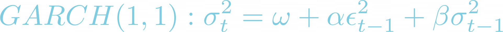

### Question 1: Understand volatility

In the financial industry, GARCH models are a popular approach to model volatility. In this exercise, you will refresh some basic concepts about volatility.

Which of the following statements is incorrect?

1. Volatility is commonly measured as the standard deviation or variance of asset price returns.
2. In general, higher volatility indicates a higher level of risk.
3. Homoskedastic data posts a big challenge for time series modeling.
4. News shocks can lead to persistent big price movement, which give rise to the phenomenon known as "volatility clustering".

**Ans.** 3

### Question 2: Observe volatility clustering

Volatility clustering is frequently observed in financial market data, and it poses a challenge for time series modeling.

In this exercise, you will get familiar with the S&P 500 daily price dataset. You will calculate daily returns as the percentage price changes, plot the results and observe its behavior over time.

Historical S&P 500 daily price data has been preloaded in sp_price for you.

**Instructions**

1. Calculate daily returns as percentage price changes and save it to the DataFrame sp_price in a new column called Return.
2. View the data by printing out the last 10 rows.
3. Plot the Return column and observe signs of volatility clustering.

**Pre Code**

```py
# Calculate daily returns as percentage price changes
sp_price['____'] = 100 * (sp_price['Close'].____())

# View the data
print(sp_price.____(____))

# plot the data
plt.plot(sp_price['____'], color = 'tomato', label = 'Daily Returns')
plt.legend(loc='upper right')
plt.show()
```

**Ans.**

```py
# Calculate daily returns as percentage price changes
sp_price['Return'] = 100 * (sp_price['Close'].pct_change())

# View the data
print(sp_price.tail(10))

# plot the data
plt.plot(sp_price['Return'], color = 'tomato', label = 'Daily Returns')
plt.legend(loc='upper right')
plt.show()
```

### Question 3: Calculate volatility

In this exercise, you will practice how to compute and convert volatility of price returns in Python.

Firstly, you will compute the daily volatility as the standard deviation of price returns. Then convert the daily volatility to monthly and annual volatility.

S&P 500 time series has been preloaded in sp_data, and the percentage price return is stored in the ’Return’ column.

**Instructions 1/2**

1. Plot the 'Return' column in sp_data.
2. Calculate the standard deviation of 'Return' data.

**Pre Code**

```py
# Plot the price returns
plt.plot(sp_data['____'], color = 'orange')
plt.show()

# Calculate daily std of returns
std_daily = sp_data['____'].____()
print('Daily volatility: ', '{:.2f}%'.format(std_daily))
```

**Ans.**

```py
# Plot the price returns
plt.plot(sp_data['Return'], color = 'orange')
plt.show()

# Calculate daily std of returns
std_daily = sp_data['Return'].std()
print('Daily volatility: ', '{:.2f}%'.format(std_daily))
```

**Instructions 2/2**

1. Calculate monthly volatility from daily volatility.
2. Calculate annual volatility from daily volatility.

**Pre Code**

```py
# Plot the price returns
plt.plot(sp_data['Return'], color = 'orange')
plt.show()

# Calculate daily std of returns
std_daily = sp_data['Return'].std()
print('Daily volatility: ', '{:.2f}%'.format(std_daily))

# Convert daily volatility to monthly volatility
std_monthly = math.sqrt(____) * ____
print ('Monthly volatility: ', '{:.2f}%'.format(std_monthly))

# Convert daily volatility to annaul volatility
std_annual = math.sqrt(____) * ____
print ('Annual volatility: ', '{:.2f}%'.format(std_annual))
```

**Ans.**

```py
# Plot the price returns
plt.plot(sp_data['Return'], color = 'orange')
plt.show()

# Calculate daily std of returns
std_daily = sp_data['Return'].std()
print('Daily volatility: ', '{:.2f}%'.format(std_daily))

# Convert daily volatility to monthly volatility
std_monthly = math.sqrt(21) * std_daily
print ('Monthly volatility: ', '{:.2f}%'.format(std_monthly))

# Convert daily volatility to annaul volatility
std_annual = math.sqrt(252) * std_daily
print ('Annual volatility: ', '{:.2f}%'.format(std_annual))
```

### Question 4: Review GARCH model basics

Given the GARCH(1,1) model equation as:



Intuitively, GARCH variance forecast can be interpreted as a weighted average of three different variance forecasts. One is a constant variance that corresponds to the long run average. The second is the new information that was not available when the previous forecast was made. The third is the forecast that was made in the previous period. The weights on these three forecasts determine how fast the variance changes with new information and how fast it reverts to its long run mean.

Which of the following statements is incorrect?

1. GARCH models are developed based on ARCH models by adding lags of previous periods of variances.
2. None of the GARCH(1,1) parameters: omega, alpha and beta can be negative.
3. GARCH(1,1) requires that alpha + beta > 1
4. The larger the alpha, the larger the immediate impact of the shock.

**Ans.** 3

### Question 5: Simulate ARCH and GARCH series

In this exercise, you will simulate an ARCH(1) and GARCH(1,1) time series respectively using a predefined function simulate_GARCH(n, omega, alpha, beta = 0).

Recall the difference between an ARCH(1) and a GARCH(1,1) model is: besides an autoregressive component of alpha multiplying lag-1 residual squared, a GARCH model includes a moving average component of beta multiplying lag-1 variance.

The predefined function will simulate an ARCH/GARCH series based on n (number of simulations), omega, alpha, and beta (0 by default) you specify. It will return simulated residuals and variances. Afterwards you will plot and observe the simulated variances from the ARCH and GARCH process.

**Instructions**

1. Simulate an ARCH(1) process with omega = 0.1, alpha = 0.7.
2. Simulate a GARCH(1,1) process with omega = 0.1, alpha = 0.7, and beta = 0.1.
3. Plot the simulated ARCH variances and GARCH variances respectively.

**Pre Code**

```py
# Simulate a ARCH(1) series
arch_resid, arch_variance = simulate_GARCH(n= 200, 
                                           omega = ____, alpha = ____)
# Simulate a GARCH(1,1) series
garch_resid, garch_variance = simulate_GARCH(n= 200, 
                                             omega = ____, alpha = ____, 
                                             beta = ____)
# Plot the ARCH variance
plt.plot(____, color = 'red', label = 'ARCH Variance')
# Plot the GARCH variance
plt.plot(____, color = 'orange', label = 'GARCH Variance')
plt.legend()
plt.show()
```

**Ans.**

```py
# Simulate a ARCH(1) series
arch_resid, arch_variance = simulate_GARCH(n= 200, 
                                           omega = 0.1, alpha = 0.7)
# Simulate a GARCH(1,1) series
garch_resid, garch_variance = simulate_GARCH(n= 200, 
                                             omega = 0.1, alpha = 0.7, 
                                             beta = 0.1)

# Plot the ARCH variance
plt.plot(arch_variance, color = 'red', label = 'ARCH Variance')
# Plot the GARCH variance
plt.plot(garch_variance, color = 'orange', label = 'GARCH Variance')
plt.legend()
plt.show()
```

### Question 6: Observe the impact of model parameters

In this exercise, you will call the predefined function simulate_GARCH() again, and study the impact of GARCH model parameters on simulated results.

Specifically, you will simulate two GARCH(1,1) time series, they have the same omega and alpha, but different beta as input.

Recall in GARCH(1,1), since beta is the coefficient of lag-1 variance, if the alpha is fixed, the larger the beta, the longer the duration of the impact. In other words, high or low volatility periods tend to persist. Pay attention to the plotted results and see whether you can verify the beta impact.

**Instructions 1/2**

1. Generate a GARCH(1,1) process with 200 simulations, omega = 0.1, alpha = 0.3, and beta = 0.2 as input.

**Pre Code**

```py
# First simulated GARCH
sim_resid, sim_variance = simulate_GARCH(n = ____,  omega = ____, 
                                          alpha = ____, beta = ____)
plt.plot(sim_variance, color = 'orange', label = 'Variance')
plt.plot(sim_resid, color = 'green', label = 'Residuals')
plt.legend(loc='upper right')
plt.show()
```

**Ans.**

```py
# First simulated GARCH
sim_resid, sim_variance = simulate_GARCH(n = 200,  omega = 0.1, 
                                          alpha = 0.3, beta = 0.2)
plt.plot(sim_variance, color = 'orange', label = 'Variance')
plt.plot(sim_resid, color = 'green', label = 'Residuals')
plt.legend(loc='upper right')
plt.show()
```

**Instructions 2/2**

1. Generate a GARCH(1,1) process with 200 simulations,omega = 0.1, alpha = 0.3, and beta = 0.6 as input.

**Pre Code**

```py
# Second simulated GARCH
sim_resid, sim_variance = simulate_GARCH(n = ____,  omega = ____, 
                                          alpha = ____, beta = ____)
plt.plot(sim_variance, color = 'red', label = 'Variance')
plt.plot(sim_resid, color = 'deepskyblue', label = 'Residuals')
plt.legend(loc='upper right')
plt.show()
```

**Ans.**

```py
# Second simulated GARCH
sim_resid, sim_variance = simulate_GARCH(n = 200,  omega = 0.1, 
                                          alpha = 0.3, beta = 0.6)
plt.plot(sim_variance, color = 'red', label = 'Variance')
plt.plot(sim_resid, color = 'deepskyblue', label = 'Residuals')
plt.legend(loc='upper right')
plt.show()
```

### Question 7: Review "arch" documentation

The Python arch package provides a comprehensive way to implement GARCH models. Use the code help(arch_model)method to check function documentation of arch_model(), and answer the question below:

Which of the following are not one of the model parameters in arch_model()?

1. mean
2. variance
3. vol
4. dist

**Ans.** 2

### Question 8: Implement a basic GARCH model

In this exercise, you will get familiar with the Python arch package, and use its functions such as arch_model() to implement a GARCH(1,1) model.

First define a basic GARCH(1,1) model, then fit the model, review the model fitting summary, and plot the results.

The data to use S&P 500 price return data has been preloaded as sp_data. Also the arch package has been imported for you.

**Instructions 1/2**

1. Define a GARCH(1,1) model basic_gm with 'constant' mean and 'normal' distribution of the residuals.
2. Fit the model basic_gm.

**Pre Code**

```py
# Specify GARCH model assumptions
basic_gm = ____(sp_data['Return'], p = ____, q = ____,
                      mean = '____', vol = 'GARCH', dist = '____')
# Fit the model
gm_result = basic_gm.____(update_freq = 4)
```

**Ans.**

```py
# Specify GARCH model assumptions
basic_gm = arch_model(sp_data['Return'], p = 1, q = 1,
                      mean = 'constant', vol = 'GARCH', dist = 'normal')
# Fit the model
gm_result = basic_gm.fit(update_freq = 4)
```

**Instructions 2/2**

1. Print a summary of the fitted GARCH model.
2. Plot the model estimated result.

**Pre Code**

```py
# Specify GARCH model assumptions
basic_gm = arch_model(sp_data['Return'], p = 1, q = 1,
                      mean = 'constant', vol = 'GARCH', dist = 'normal')
# Fit the model
gm_result = basic_gm.fit(update_freq = 4)

# Display model fitting summary
print(gm_result.____())

# Plot fitted results
gm_result.____()
plt.show()
```

**Ans.**

```py
# Specify GARCH model assumptions
basic_gm = arch_model(sp_data['Return'], p = 1, q = 1,
                      mean = 'constant', vol = 'GARCH', dist = 'normal')
# Fit the model
gm_result = basic_gm.fit(update_freq = 4)

# Display model fitting summary
print(gm_result.summary())

# Plot fitted results
gm_result.plot()
plt.show()
```

### Question 9: Make forecast with GARCH models

Previously you have implemented a basic GARCH(1,1) model with the Python arch package. In this exercise, you will practice making a basic volatility forecast.

You will again use the historical returns of S&P 500 time series. First define and fit a GARCH(1,1) model with all available observations, then call .forecast() to make a prediction. By default it produces a 1-step ahead estimate. You can use horizon = n to specify longer forward periods.

The arch package has been preloaded for you.

**Instructions 1/2**

1. Define a basic GARCH(1,1) model basic_gm.
2. Fit the model.

**Pre Code**

```py
# Specify a GARCH(1,1) model
basic_gm = ____(sp_data['Return'], p = 1, q = 1, 
                      mean = 'constant', vol = 'GARCH', dist = 'normal')
# Fit the model
gm_result = basic_gm.____()
```

**Ans.**

```py
# Specify a GARCH(1,1) model
basic_gm = arch_model(sp_data['Return'], p = 1, q = 1, 
                      mean = 'constant', vol = 'GARCH', dist = 'normal')
# Fit the model
gm_result = basic_gm.fit()
```

**Instructions 2/2**

1. Use the fitted model gm_result to make 5-period ahead variance forecast.
2. Print out the variance forecast result.

**Pre Code**

```py
# Specify a GARCH(1,1) model
basic_gm = arch_model(sp_data['Return'], p = 1, q = 1, 
                      mean = 'constant', vol = 'GARCH', dist = 'normal')
# Fit the model
gm_result = basic_gm.fit()

# Make 5-period ahead forecast
gm_forecast = gm_result.____(horizon = ____)

# Print the forecast variance
print(gm_forecast.____[-1:])
```

**Ans.**

```py
# Specify a GARCH(1,1) model
basic_gm = arch_model(sp_data['Return'], p = 1, q = 1, 
                      mean = 'constant', vol = 'GARCH', dist = 'normal')
# Fit the model
gm_result = basic_gm.fit()

# Make 5-period ahead forecast
gm_forecast = gm_result.forecast(horizon = 5)

# Print the forecast variance
print(gm_forecast.variance[-1:])
```

<hr>