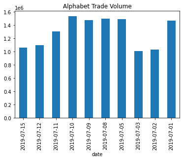

### Question 1: Why use describe

Why is it a good idea to run .describe() on a new DataFrame?

1. To understand the shape and range of the data.
2. To conform the data to a uniform data type.
3. To make the data understandable as a visual plot.

**Ans.** 1

### Question 2: Peek at top and bottom

Analyzing historical price data is an important way to try to make future predictions. We will be using a dataset of stock data for the company Alphabet. This data includes opening, closing, high, and low prices per day. It is loaded into the DataFrame alphabet. Now it's your time to take a peak!

**Instructions 1/3**

1. Get the first five rows of data.

**Pre Code**

```py
# Peak at top five rows
alphabet.____()
```

**Ans.**

```py
# Peak at top five rows
alphabet.head(5)
```

**Instructions 2/3**

1. Peek at the top seven rows.

**Pre Code**

```py
# Peak at top seven rows.
alphabet.____
```

**Ans.**

```py
# Peak at top seven rows.
alphabet.head(7)
```

**Instructions 3/3**

1. Peek at the just the last row.

**Pre Code**

```py
# Peak at last row.
alphabet.____
```

**Ans.**

```py
# Peak at last row.
alphabet.tail(1)
```

### Question 3: Describing data

Let continue investigating our historical stock data for Alphabet. In this exercise you will be asked to look at the summary statistics for the dataset. This is something you will want to do with most financial data to understand its range and shape. Once again the data is loaded into a DataFrame named alphabet.

**Instructions 1/3**

1. Get the summary statistics for all of the numeric columns.

**Pre Code**

```py
# Get stats for all numeric columns
alphabet.____()
```

**Ans.**

```py
# Get stats for all numeric columns
alphabet.describe()
```

**Instructions 2/3**

1. Get the summary statistics only for columns whose type is int.

**Pre Code**

```py
# Get stats for integer columns only
alphabet.____(____='____')
```

**Ans.**

```py
# Get stats for integer columns only
alphabet.describe(include='int')
```

**Instructions 3/3**

1. Get the summary statistics for all numeric columns, but with percentiles for %30, %50, and %60.

**Pre Code**

```py
# Stats with percentiles for %30, %50, and %60
alphabet.____(____=[____, ____, ____])
```

**Ans.**

```py
# Stats with percentiles for %30, %50, and %60
alphabet.describe(percentiles=[.3, .5, .6])
```

### Question 4: Why filter data

Which would be a good case to solve by using masking and filtering on a DataFrame of stock data?

1. You wish to see the average closing price of all of the data.
2. You wish to see the standard deviation of the closing price.
3. You wish to see all days with a closing price above $400

**Ans.** 3

### Question 5: Filtering stock data.

For this exercise you will be filtering Alphabet stock data, once again working with a DataFrame alphabet. 

**Instructions 1/3**

1. Create a mask for all of the rows whose daily high is greater than $500.
2. Create a DataFrame using this mask.

**Pre Code**

```py
# Mask for large enough daily high
high_mask = alphabet.high ____ 500

# Filter using the mask
alphabet.____[____]
```

**Ans.**

```py
# Mask for large enough daily high
high_mask = alphabet.high > 500

# Filter using the mask
alphabet.loc[high_mask]
```

**Instructions 2/3**

1. Create a mask for the volume of 1771271.
2. Create a DataFrame of row(s) with a volume of 1771271.

**Pre Code**

```py
# Mask for specific volume
volume_mask = alphabet.____ ____ 1771271

# Filter using the mask
alphabet.loc____
```

**Ans.**

```py
# Mask for specific volume
volume_mask = alphabet.volume == 1771271

# Filter using the mask
alphabet.loc[volume_mask]
```

**Instructions 3/3**

1. Make a mask for all rows where the volume does not equal 1997999.
2. Filter using this mask.

**Pre Code**

```py
# Mask rows whose volume is not 1997999
volume_mask = alphabet.____ ____ 1997999

# Filter using the mask
____.____
```

**Ans.**

```py
# Mask rows whose volume is not 1997999
volume_mask = alphabet.volume != 1997999

# Filter using the mask
alphabet.loc[volume_mask]
```

### Question 6: Selecting data from data range

Pulling data that meets specific conditions is one of the most powerful and commonly used operations with DataFrames. You can try it now with Alphabet stock data. Provided is the DataFrame alphabet and the datetimes start_date and end_date. 

**Instructions**

1. Create a mask of historical dates in the given date range.
2. A mask can be used to make a selection of rows from a DataFrame.

**Pre Code**

```py
# Calculate the mask for one week
mask = (alphabet['date'] ____ start_date) & (alphabet['____'] <= end_date)

# Use the mask to get the data for one week
df = alphabet[____]

# Look at result
print(df)
```

**Ans.**

```py
# Calculate the mask for one week
mask = (alphabet['date'] >= start_date) & (alphabet['date'] <= end_date)

# Use the mask to get the data for one week
df = alphabet[mask]

# Look at result
print(df)
```

### Question 7: Identifying plot type

Fill in the blank to produce this plot: banks.plot(x='Date', y='Transactions', kind=____)



1. line
2. bar
3. hist

**Ans.** 2

### Question 8: Making a line plot

In this exercise you will be creating a line plot using two weeks of our Alphabet stock data. 

**Instructions 1/3**

1. Create a line plot of the high price using the date for the x-axis.

**Pre Code**

```py
# Plot the daily high price
alphabet2w.____(____ = 'high')
```

**Ans.**

```py
# Plot the daily high price
alphabet2w.plot(y = 'high')
```

**Instructions 2/3**

1. Now rotate the x-axis label by 90 degrees.

**Pre Code**

```py
# Plot the daily high price
alphabet2w.____(y='high', ____=____)
```

**Ans.**

```py
# Plot the daily high price
alphabet2w.plot(y='high', rot=90)
```

**Instructions 3/3**

1. Add the title "High Daily Prices" to the plot.

**Pre Code**

```py
# Plot the daily high price
alphabet2w.____(____='high', ____=90, ____='High Daily Prices')
```

**Ans.**

```py
# Plot the daily high price
alphabet2w.plot(y='high', rot=90, title='High Daily Prices')
```

### Question 9: Choose kind of plot

Let's make some different kinds of plots using our two-weeks of Alphabet stock data

**Instructions 1/3**

1. Create a line plot of the daily trading volume using the date as the x-axis.

**Pre Code**

```py
# Plot daily trade volume
alphabet2w.____(____='____', rot=90, title='Alphabet Daily Volume')
```

**Ans.**

```py
# Plot daily trade volume
alphabet2w.plot(y='volume', rot=90, title='Alphabet Daily Volume')
```

**Instructions 2/3**

1. Plot the volume using a bar plot.

**Pre Code**

```py
# Plot daily trade volume
alphabet2w.plot(y='volume', ____='____', title='Alphabet Daily Volume')
```

**Ans.**

```py
# Plot daily trade volume
alphabet2w.plot(y='volume', kind='bar', title='Alphabet Daily Volume')
```

**Instructions 3/3**

1. Create a histogram of the daily volume.

**Pre Code**

```py
# Plot daily trade volume
alphabet2w.____(____='volume', ____='____', ____='Alphabet Daily Volume')
```

**Ans.**

```py
# Plot daily trade volume
alphabet2w.plot(y='volume', kind='hist', title='Alphabet Daily Volume')
```

<hr>